Elk

elastisearch引擎：分布式搜索分布件；

基础知识：

1、什么是倒排索引？

在一个文档集合中，每个文档都可视为一个词语的集合，倒排索引则是将词语映射到包含这个词语的文档的数据结构

2、如何实现倒排索引？

2.1、文档预处理

2.2、构建字典

2.3、创建倒排列表

2.4、储存索引文件

2.5、查询处理

3、什么是全文检索？

全文检索（Full-TextSearch）是一种从大量文本数据中快速检索出包含指定词汇或短语的信息的技术。

4、为啥需要索引别名

场景1：面对PB级别的增量数据，对外提供服务的是基于日期切分的n个不同索引，每次检索都要指定数十个甚至数百个索引，非常麻烦。
场景2：线上提供服务的某个索引设计不合理，比如某字段分词定义不准确，那么如何保证对外提供服务不停止，也就是在不更改业务代码的前提下更换索引？

若索引和别名指向相同，则在相同检索条件下的检索效率是一致的，因为索引别名只是物理索引的软链接的名称而已。注意:
1)对相同索引别名的物理索引建议有一致的映射，以提升检索效率。
2)推荐充分发挥索引别名在检索方面的优势，但在写入和更新时还得使用物理索引。

```
PUT index1
{
  "aliases": {
    "myindex_alias": {}
  }
}
```

给多个索引添加别名

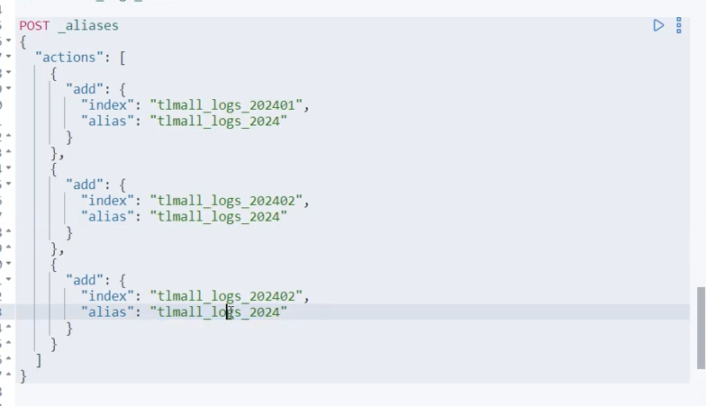


常用接口：

1、新建index 索引
索引名称必须是小写字母，可以包含数字和下划线。
●索引设置（settings)
1)分片数量(numberofshards)
一个索引的分片数决定了索引的并行度和数据分布。
示例：

```
"number_of_shards":1
```

2)副本数量(numberofreplicas)
副本提高了数据的可用性和容错能力。
示例：

```
"number_of_replicas":1
```

3)映射(mappings)
字段属性（properties)定义索引中文档的字段及其类型。常用字段类型包括：text，keyword，integer, float, date 等。

示例："properties":{

```
"field1":{
"type":"text"
},
"field2":{
"type"："keyword"
}
```

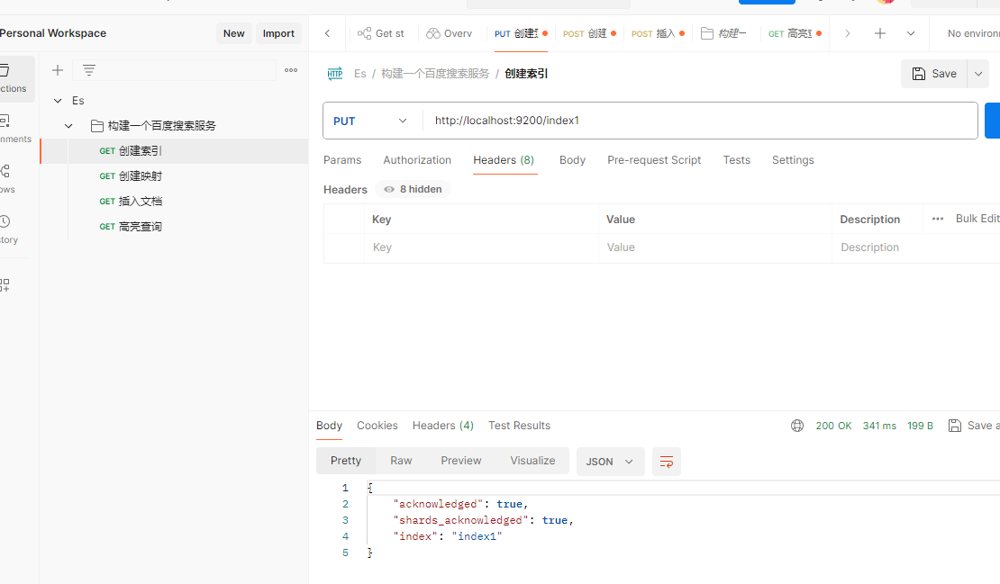

2、新建mapping:映射配置分词器；内容格式


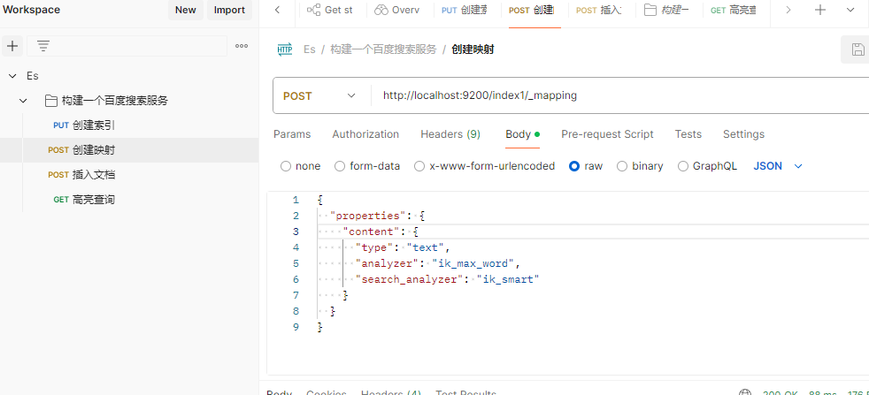

3、插入文档；**`PUT _create/1` 是 “只新增、不覆盖”，`PUT _doc/1` 是 “存在就覆盖、不存在就新增”**。

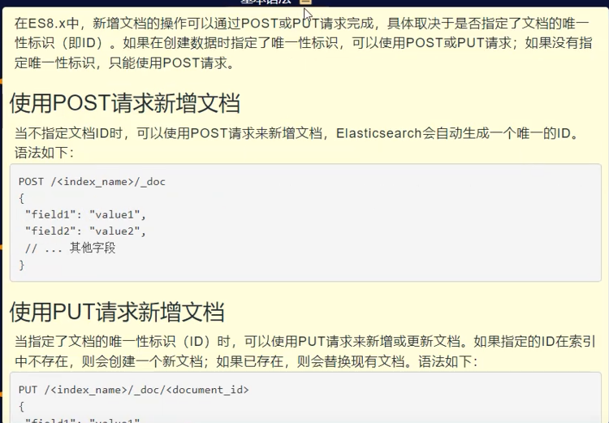

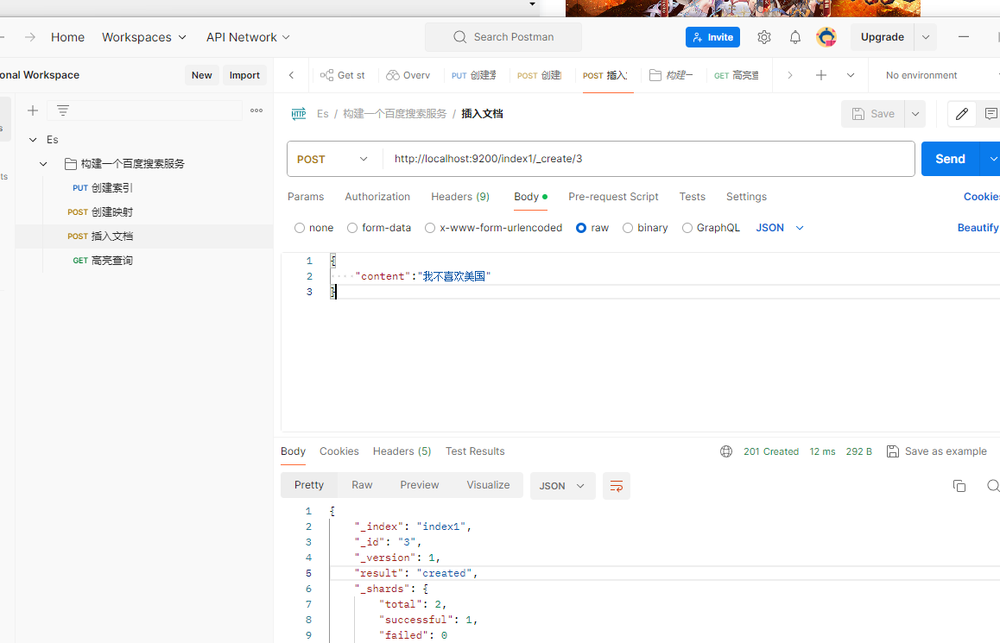

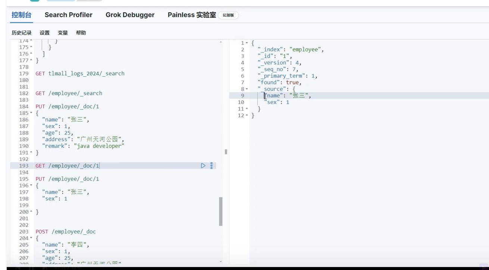

4、高亮查询

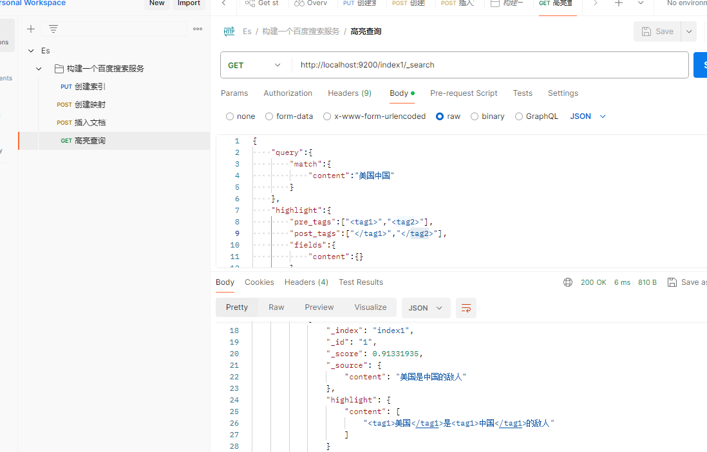


5、删除索引

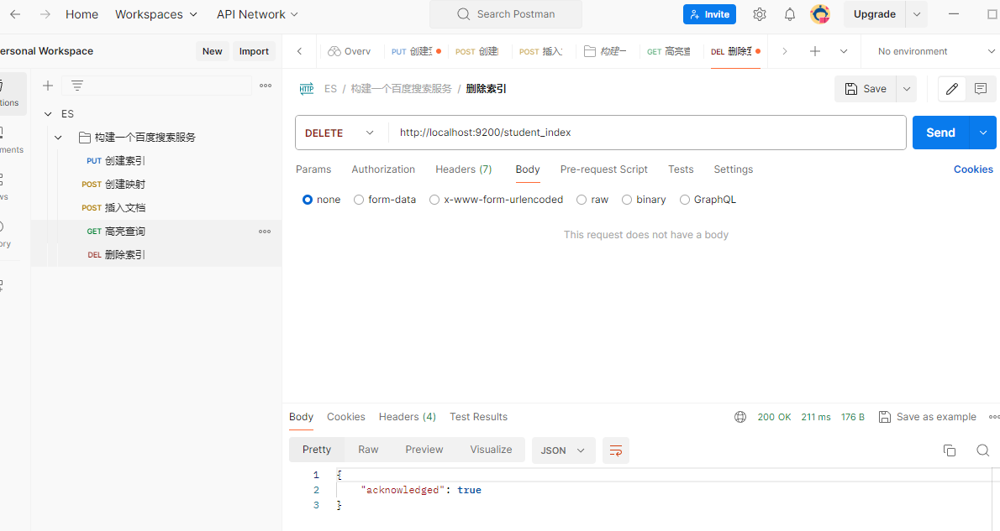

删除查询出来的数据


6、更新文档

局部修改：


批量局部更新

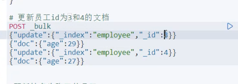

根据条件更新

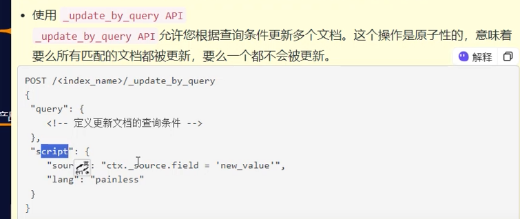

```
PosT /employee/_update_by_query
{
  “query":{
  	"term":{
  		"name”:"张三"
  		   }
  		 },
"script":{
	"source": {"ctx._source.age =30"}
```

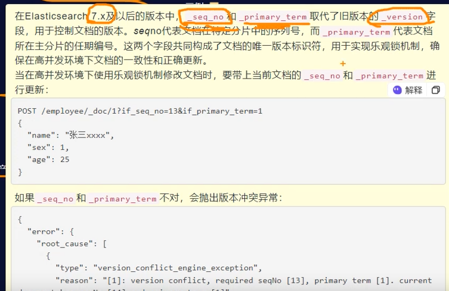

并发执行案例（全量修改）：

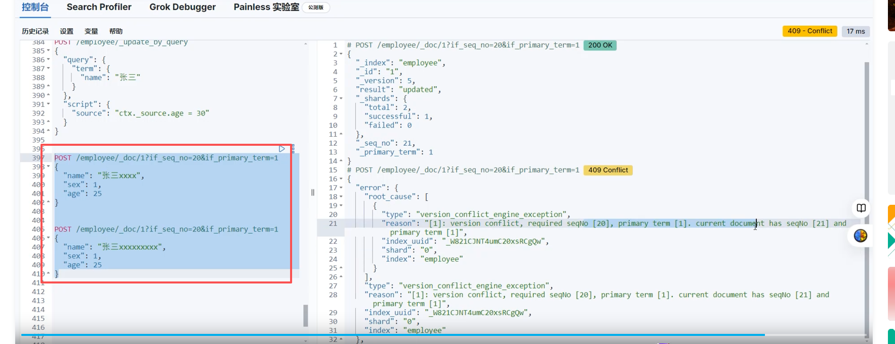


4.ElasticSearch文件建模最佳实践
4.1Elasticsearch中如何处理关联关系
Elasticsearch多表关联的问题是讨论最多的问题之一。多表关联通常指一对多或者多对多的数据关系，如博客及其评论的关系。Elasticsearch并不擅长处理关联关系，一般会采用以下四种方法处理关联:

###   1嵌套对象(Nested Object)

Nested类型适用于一对少量、子文档偶尔更新、查询频繁的场景。如果需要索引对象数组并保持数组中每个对象的独立性，则应使用Nested数据类型而不是  Object数据类型。Nested类型的优点是Nested文档可以将父子关系的两部分数据关联起来(例如博客与评论)，可以基于Nested类型做任何查询。
其缺点则是查询相对较慢，更新子文档时需要更新整篇文档。

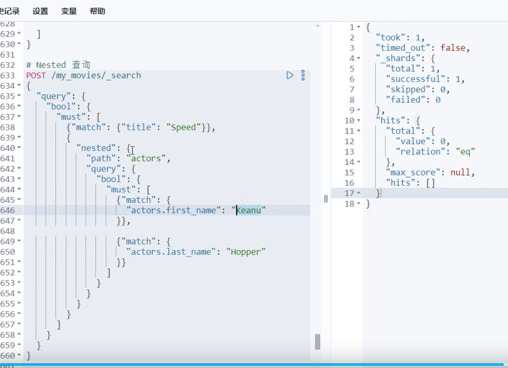

###  2 Join父子文档类型

Join类型用于在同一索引的文档中创建父子关系。Join类型适用于子文档数据量明显多于父文档的数据量的场景，该场景存在一对多量的关系，子文档更新频繁。举例来说，一个产品和供应商之间就是一对多的关联关系。当使用父子文档时，使用has_child或者has_parent做父子关联查询。
Join类型的优点是父子文档可独立更新。缺点则是维护Join关系需要占据部分内存，查询较Nested类型更耗资源。
个

###   3宽表冗余存储

宽表适用于一对多或者多对多的关联关系。
宽表的优点是速度快。缺点则是索引更新或删除数据时，应用程序不得不处理宽表的冗余数据;并且由于冗余存储，某些搜索和聚合操作的结果可能不准确。

###  4业务端关联

这是普遍使用的技术，即在应用接口层面处理关联关系。一般建议在存储层面使用两个独立索引存储，在实际业务层面这将分为两次请求来完成。
业务端关联适用于数据量少的多表关联业务场景。数据量少时，用户体验好;而数据量多时，两次查询耗时肯定会比较长，反而影响用户体验。


kibana:可视化搜索展示工具；

```

PUT /student_index
{
  "settings": {
    "number_of_shards": 1,
    "number_of_replicas": 1
  },
  "mappings": {
    "properties": {
      "name": {
        "type": "text"
      },
      "age": {
        "type": "integer"
      },
      "enrolled_date": {
        "type": "date"
      }
    }
  }
}
```

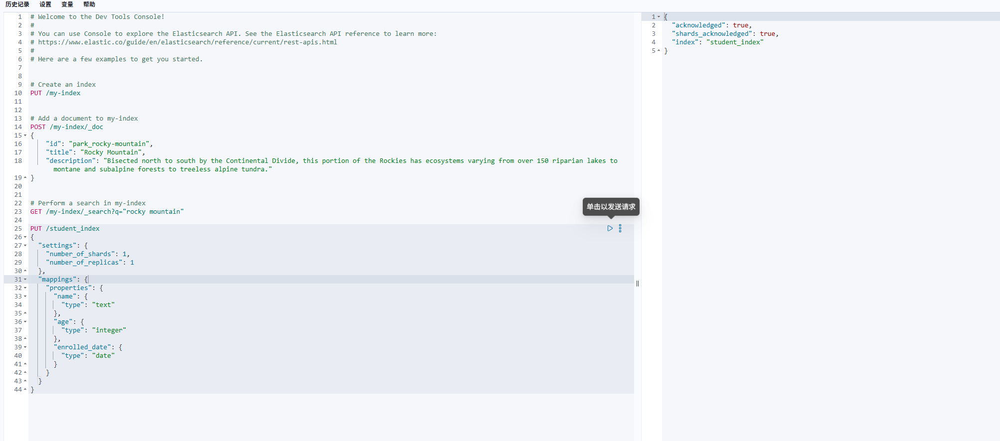


