# JVM前言

>聊聊常见面试题

1、请你谈谈你对jvm的理解？Java虚拟机有什么更新？

2、什么时OOM，请你说说OOM产生的原因？如何分析？

3、JVM的常见调优参数有哪些？

4、内存快照抓取，如何分析,命令是什么？

5、堆里分区：eden、survial(from、to)、老年区

6、GC垃圾收集算法有哪几个？谈谈利弊？

>BAT难度的面试题

1、JVM垃圾回收的时候如何确定垃圾，GCRoot?

2、-X、-XX参数你用过哪些？

3、常见的项目发布后配置过JVM调优参数吗？

4、引用、强引用、弱引用、虚引用？

5、GC垃圾回收器和GC回收算法关系？分别有哪些？

6、谈谈默认的垃圾回收器？

7、垃圾回收器的特点？

8、OOM你看过几种？

# JVM类加载器ClassLoader

>类的加载、连接和初始化将car.class转为car Class

加载：查询.class文件并加载类的二进制数据

连接：

- 验证：保证被记载的类的正确性；
- 准备：给类的静态变量分配空间，赋值默认初始值；
- 解析：把类中的符号引用转换为直接引用；

初始化：给类的静态变量赋值正确的值；

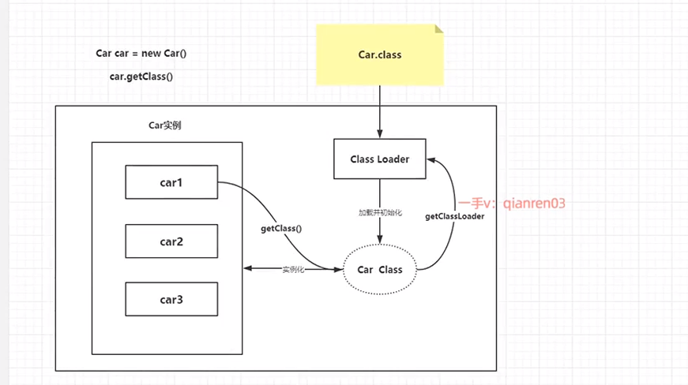

>类加载器分类

1、java虚拟机自带的加载器

- bootStrap 根加载器（加载系统的包，jdk核心库中的rt.jar）
- Ext              扩展类加载器（加载一些扩展jar包的类）
- Sys/App     系统/应用加载器 （我们编写的类）

2、用户自己定义的加载器

- ClassLaoder只需要继承这个抽象类即可，自定义自己的类加载器

双亲委派机制：可以保护java核心类不会被自定义的类替换

# 类的加载

```
/**
 * JVM参数有： -XX:+TraceClassLoading //1、用于追踪类的加载信息行打印 2、 分析项目为啥启动慢，可以快速定位自己类有没有被加载
 */
public class Main {

    public static void main(String[] args) throws InterruptedException {
        System.out.println(MyChild.str);
        //结果
        //MyParent static
        //MyChild static
        //hello MyChild
    }
}
class MyParent{
    static {
        System.out.println("MyParent static");
    }
    public static String str = "hello MyParent";
}

class MyChild extends MyParent{
    static {
        System.out.println("MyChild static");
    }
    public static String str = "hello MyChild";
}
```

# final加载分析

```
public class Main {

    public static void main(String[] args) throws InterruptedException {
        System.out.println(MyParent.str);
        /**
         *fianl常量编译阶段  常量池
         * 这个代码将常量放到了Main的常量池中，之后访问的str与MyParent.str都无关了
         * 所以返回结果虽然是hello MyParent ，但是不会触发System.out.println("MyParent static");
         */
    }
}
class MyParent{
    static {
        System.out.println("MyParent static");
    }
    public static final String str = "hello MyParent";
}
```

```
public class Main {

    public static void main(String[] args) throws InterruptedException {
        System.out.println(MyParent.str);
        /**
         *当一个常量并非在编译时就可以确定的，那么这个常量就不会保存在方法调用类的静态常量池中。
         * 程序运行期间的时候会主动使用常用的类
         */
    }
}
class MyParent{
    static {
        System.out.println("MyParent static");
    }
    public static final  String str = UUID.randomUUID().toString();
}
```

**编译优化过程：**
在编译阶段，`MyParent.str`  会被直接替换为字面量  `"hello MyParent"`。生成的 `Main.class` 字节码中**不会出现对 `MyParent` 类的符号引用**。

# Native方法

Native：只要带了这个关键字就说明java作用范围达不到，只能调用底层C语言的库！

```
public class Main {

    public static void main(String[] args) throws InterruptedException, AWTException {
        Robot robot = new Robot();
        robot.mouseMove(100,100);//控制鼠标位置
    }
}
```

# 程序计数器

线程私有，每个线程都由一个程序计数器；

程序计数器占有一个十分小的内存空间作用为：控制字节码执行位置

分支、循环、跳转、异常处理都需要依赖程序计数器来完成！

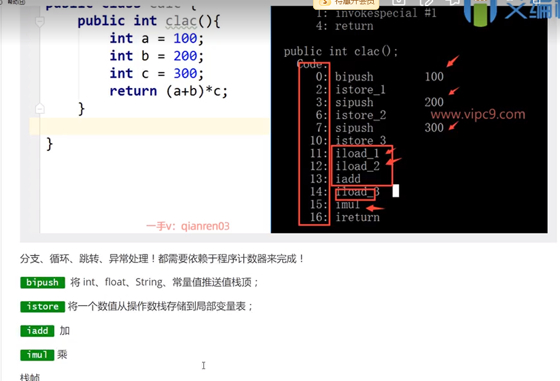

# 方法区的今生前世

Method Area方法区是Java虚拟机规范中定义的运行时数据区域一直和堆一样可以线程共享！

jdk1.7之前

永久代：用于存储一些虚拟机加载类的信息、常量、字符串、静态变量、符号引用、方法代码等。。。这些东西都放在永久代中；

但是永久代空间有限，满了后会报错`outOfMemery:java PermGen`

jdk1.8之后

将永久代改名为元空间 ，原来的东西放在堆中或者元空间Metaspace空间；

元空间就是方法区在hotspot jvm的实现；

元空间和永久代都是jvm规范中方法区的实现。

区别：元空间不在虚拟机内存，而是本地内存！

`-XX:MetaspaceSize10m`

如果元空间满了报错：`outOfMemery: Metaspace`

# 栈Stack

>栈和队列

程序=数据结构+算法

栈和队列都是基本的数据结构

栈的优势：存取速度比堆快！仅次于寄存器，栈的数据不可以共享

栈里面一定不存在垃圾回收问题，只要线程结束该栈就回收

>栈的原理

java栈的组成元素--栈帧

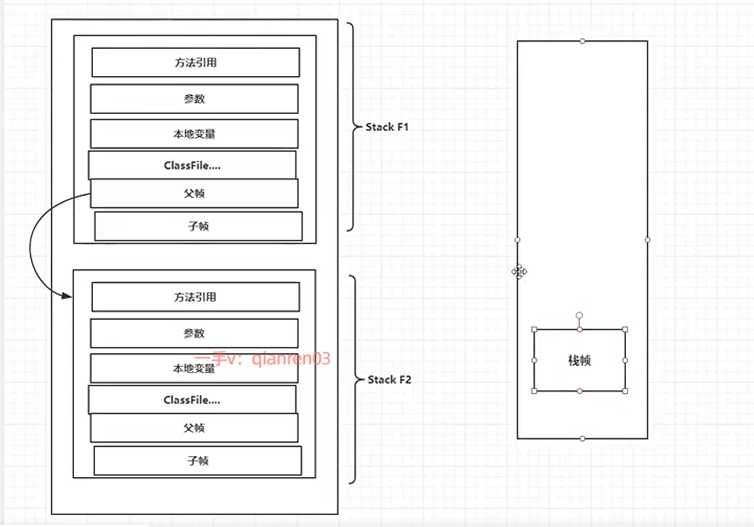

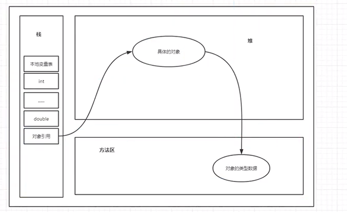

谈谈你认识几种JVM？

- SUN公司 Hotspot
- BEA公司 JRockit
- IBM公司 J9VM

# 堆（heap）

**java7之前：**

Heap堆：一个jvm实例中只存在一个堆，堆的内存大小时可以调节的。

可以存的内容：类、方法、常量、保留了类型引用的真实信息；

**分为三个部分**

- 新生区：Young   (Eden-s0-s1)

- 养老区：Old Tenure

- 永久区：Perm

  堆内存在逻辑上分为三个部分：新生、养老、永久（JDK1.8以后叫元空间）

  物理上只有新生区和养老区i，元空间在本地内存中！不在jvm中！

**垃圾回收主要是在新生区和养老区，又分为 普通GC和FULL GC，如果堆满了，就会报错OOM**

>新生区

新生区就是一个类诞生、成长、消亡的地方！、

*新生区细分*：Eden、s0/s1  ,所有的类都在Eden被new出来的，慢慢的当Eden满了，程序还需要创建对象时程序就会触发轻量级的GC，清理完一次垃圾之后，会将活着的对象放入幸存区。99%信息都在Eden区。

Sun Hotspot虚拟机中内存管理采用分代管理机制，即不同的区域采用不同的算法！

>养老区

超过15次对象还没被清理则将送到养老区;运行几个月后养老区如果也满了就触发重FULL GC ;

> 永久区

放一些jdk自带的Class、interface的元数据；

几乎不会被垃圾回收的;

`OutofMemoryError:PermGen` 在项目启动的时候永久代不够用？可能是加载了太多第三方包！

JDK1.6之前：有永久代、常量池在方法区；

JDK1.7：有永久代，但是开始尝试去掉永久代，常量池在堆中；

JDK1.8之后：永久代被取代为元空间；常量池在元空间中；

闲聊：方法区和堆一样，是共享的区域，是JVM规范中的一个逻辑的部分，但是记住它的别名`非堆`

元空间：它是本地内存！

口诀：关于垃圾回收：分代收集算法 即不同的区域采用不同的算法

Young: GC频繁区域

Old:GC次数较少

Perm:不会产生GC

**特点：**

普通GC:只针对新生代 [GC]

全局GC:主要是针对老年代，偶尔伴随新生代 [FULL GC]

# 堆内存调优（初识）

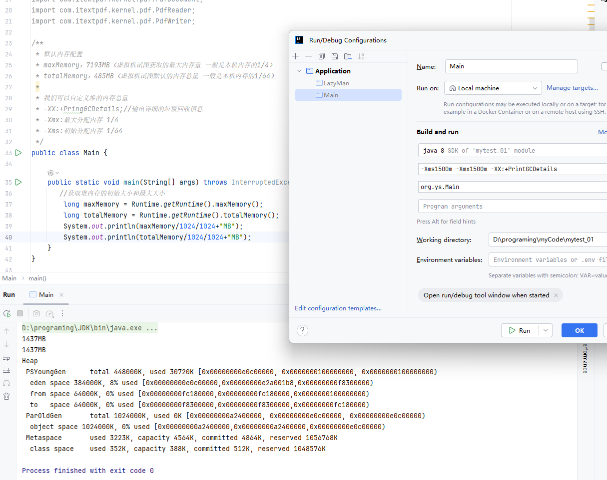

```
/**
 * 默认内存配置
 * maxMemory：7193MB（虚拟机试图获取的最大内存量 一般是本机内存的1/4）
 * totalMemory：485MB（虚拟机试图默认的内存总量 一般是本机内存的1/64）
 *
 * 我们可以自定义堆的内存总量
 * -XX:+PringGCDetails;//输出详细的垃圾回收信息
 * -Xmx:最大分配内存 1/4
 * -Xms:初始分配内存 1/64
 */
public class Main {

    public static void main(String[] args) throws InterruptedException, AWTException {
       //获取堆内存的初始大小和最大大小
        long maxMemory = Runtime.getRuntime().maxMemory();
        long totalMemory = Runtime.getRuntime().totalMemory();
        System.out.println(maxMemory/1024/1024+"MB");
        System.out.println(totalMemory/1024/1024+"MB");
    }
}
```

# Dump内存快照及JProfiler

请你说说工作中怎么排查OOM

1、运行前操作

2、监控！

在Java程序运行的时候，想要测试运行的情况！

使用一些工具来查看；

1. Jconsole
2. idea debug
3. IDEA(JProfiler插件)

>JProfile插件

一款性能瓶颈分析插件

```
/**
 * 默认内存配置
 -Xmx1m -Xms1m -XX:+HeapDumpOnOutOfMemoryError
 */
public class Main {
    byte[] bytes = new byte[1024 * 1024 * 100];
    private ArrayList<Main> list = new ArrayList<>();
   public void test() throws InterruptedException {
       Main main = new Main();
       list.add(main);
   }
    public static void main(String[] args) throws InterruptedException, AWTException {
        Main main = new Main();
        main.test();
    }
}

```

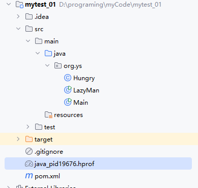


# GC四大算法

**1、JVM垃圾回收的时候如何确定垃圾，GCRoot?**

什么是垃圾:简单来说就是不再被引用的对象！

>引用计数法（了解即可）

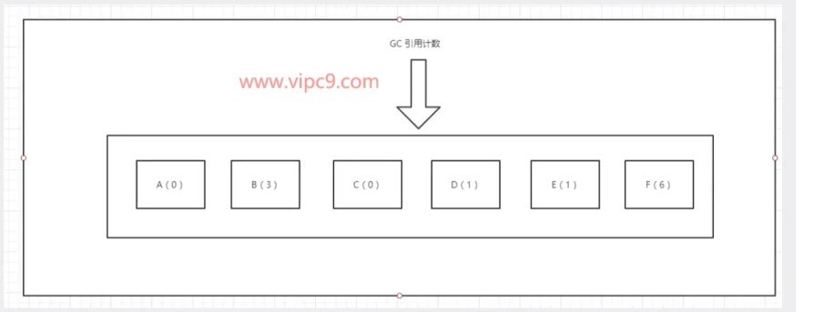

特点：每个对象都有一个引用计数器，每引用一次计数器+1，为0则直接垃圾回收

缺点：

- 计数器维护麻烦
- 循环引用无法处理！

JVM一般不采用这种方式！

>可达性算法，GC Root(普遍使用)

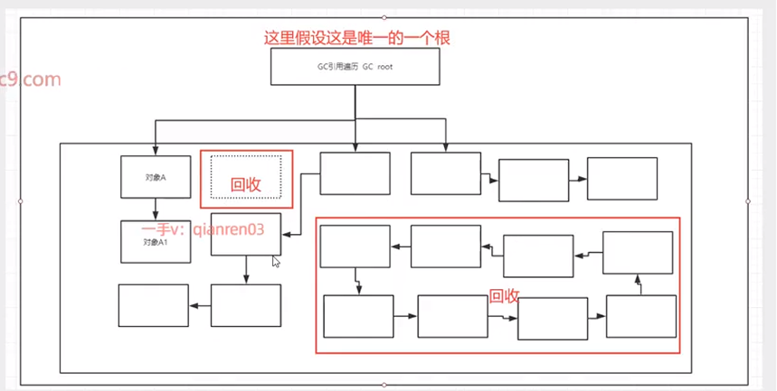

一切都是从GC Root这个对象开始遍历的，只有和GC Root这个对象关联就不是垃圾！

**什么是GC Root？**

- 虚拟机栈中引用的对象！
- 类中静态属性引用的对象
- 方法区的常量
- 本地方法栈Native引用的对象


>复制算法

年轻代中就是使用复制算法！因为年轻代对象存活率低，适合全部复制过去，而不是检索某一部分对象复制过去！

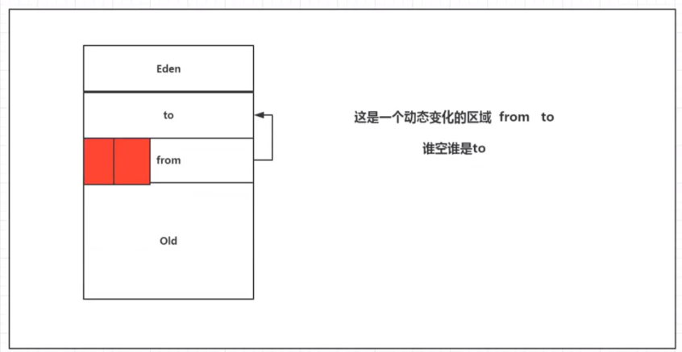

1、一般普通GC之后，差不多Eden几乎都是空的！

2、每次存活的对象都会被From区和Eden区等复制到to区，from和to会发生一次交换；说白了，谁空谁就是to，每当幸存一次就会导致这个对象年龄加一；如果这年龄大于15则会进入老年代

优点：没有标记和清除的过程，效率高！没有内存碎片！

缺点：需要浪费双倍的空间！

>标记清除算法

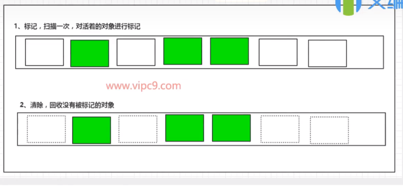

优点：不需要额外的空间

缺点: 两次扫描，内存活得对象耗时则比较多，会产生内存碎片，只能适合存活率高低的区域；

>标记压缩算法

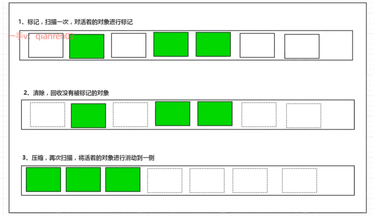

减少了上面标记清除的缺点，没有内存碎片但是再次加了一次扫描导致耗时更加严重！

那我们什么时候考虑使用标记压缩算法呢？

在我们这个要是有算法的空间种中，假设空间很少，不经常使用GC,那么可以考虑这个算法！

>**小总结**

内存效率：复制算法>标记清除>标记压缩算法

内存整齐度：复制算法=标记压缩>标记清除

内存利用率：标记压缩算法=标记清除>复制算法

**从效率上说，复制算法最好，空间但是浪费的比较多！为了兼顾所有指标，标记压缩算法会平滑一些，只是效率上不太行！**


**难道没有一种最优的算大吗？思考一下：**

没有！分代收集算法：不同的区域使用不同的算法！没有最好的只有最合适的！


**年轻代：**

相对于老年区，对象存活率低！

Eden区对象存活率极低！统计99%对象基本第一次使用后都会失效！推荐使用复制算法


**老年代：**

区域比较大，对象存活率较高！

推荐使用：标记清除/压缩！

# -XX、-XX参数你用过哪些？JVM有哪些参数可以来调优？

jvm只有三种参数类型：标配参数、X参数，XX参数；

>标配参数：在各个版本之间都很稳定，很少变化

```
java -version
java -help
....
```


>-X参数（了解即可）

```
-Xint   #解释执行
-Xcomp  #第一次使用就编译成本地的代码
-Xmixed #混合执行，一边编译一边解释
```

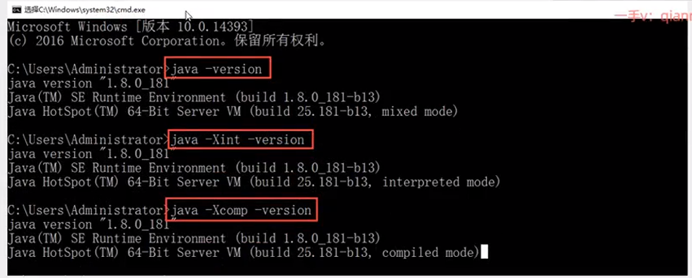


>重点(-XX参数)

-XX:+或者-某一个属性值，+代表开启某一个功能，-表示关闭某一个功能！

```
public class Main {
    public static void main(String[] args) throws InterruptedException, AWTException {
        System.out.println("hello word!");
        Thread.sleep(MAX_VALUE);
    }
}
```

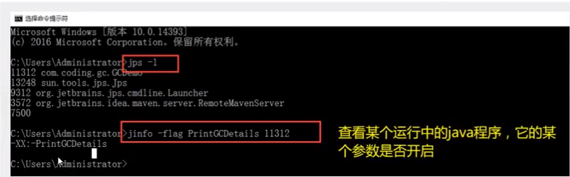


>-XX参数 之key-value型;

元空间大小：`-XX:MetaspaceSize=128M`

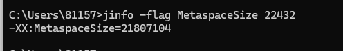

控制进入老年区存活年限（默认15次）

用法：`-XX:MaxTenuringThreshold=15`

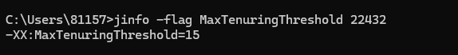

>查看所有默认值

`jps -l`

`jinfo -flags 22432`

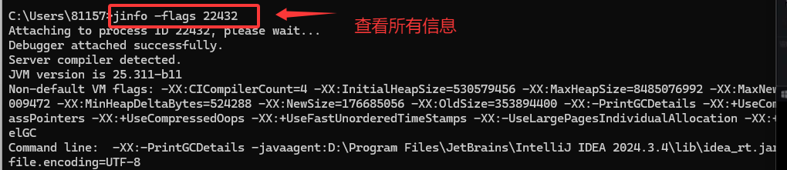


>经典面试题：-Xmx,-Xms,怎么解释？

1. `Xmx` 最大堆的大小，等价于`-XX:InitialHeapSize`
2. `Xms` 初始堆的大小，等价于`-XX:MaxHeapSize`

最常用的东西都有语法糖吗，方便使用记忆！


>初始的默认值是多少？

`java -XX:+PrintFlagsInitial`

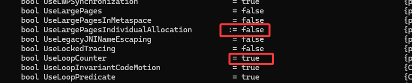

`:=`表示被修改了；

`java -XX:+PrintCommandLineFlags -version`  打印用户手动设置的-XX参数

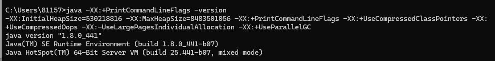

>-Xss: 线程栈大小 一般512k-1024k
>
>-XX: SurvivorRatio 设置新生代中s0/s1空间比例    `unit  -XX: SurvivorRatio =4 `
>
>表示Eden:s0:s1= 4：1：1

# 请你谈谈你对OOM的认识？

>堆溢出（常见）

>栈溢出（常见）

>`java.lang.OutOfMemoryError:  GC overhead limit exceeded`  GC回收时间过长也会导致OOM！

代码逻辑出错，CPU占有率100%，GC一直没有好的效果！导致报错！

```
/**
 * 默认内存配置
 -Xmx1m -Xms1m -XX:+PrintGCDetails -XX:+MaxDirectMemorySize=5m
 */
public class Main {
    public static void main(String[] args) throws InterruptedException, AWTException {
       int i =0;
        ArrayList<String> list = new ArrayList<>();
        try {
            while (true) {
                list.add(String.valueOf(i++).intern());
            }
        } catch (OutOfMemoryError e) {
            System.out.println(i);
            e.printStackTrace();
        }

    }
}
```

>`java.lang.OutOfMemoryError: Direct buffer memory ` 基础缓冲区的错误导致OOM！(少见)
>
>超过 MaxDirectMemorySize 限制;Netty 等 NIO 框架使用不当;未正确释放 Direct Buffer；
>
>频繁创建大量 Direct Buffer：

>`java.lang.OutOfMemoryError: unable to create native Thread`  服务器线程不够导致OOM！

高并发，unable to create native Thread这个错误更多时候是和平台有关系！

1. 应用创建的线程过多！
2. 服务器不允许你创建这么多线程！ 

>`java.lang.OutOfMemoryError: 元空间报错！

元空间里内容：

- 虚拟机的类信息、方法和字段的描述信息
- 常量池
- 静态变量
- JIT 编译器编译后的方法代码（部分）
- 。。。

# 请你谈谈垃圾收集器（理解）

**GC算法**（引用计数器、复制、标记清除、标记压缩）方法论，垃圾收集器就是对应的落地实现！

>四种垃圾收集器

1. 串行（STW: stop the world）单线程模式，停止一切工作线程，进行GC垃圾回收直到回收结束

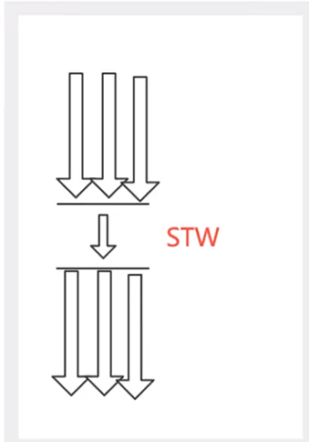

1. 并行垃圾回收器（多线程工作，也会导致STW）

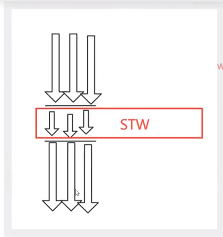

1. 并发垃圾回收器(Z在回收垃圾的同时可以正常执行流程，如何cpu为单核则只能交替执行！)

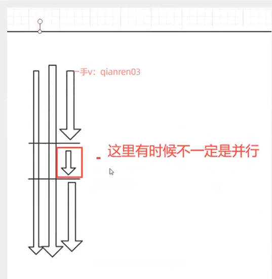

1. G1垃圾回收器（将堆内存分割成不同的区域，然后并发对其进行垃圾回收，Java9之后默认G1）

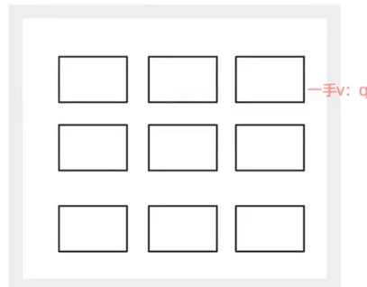

>垃圾回收器

**查看默认的垃圾回收器** `java -XX:+PrintCommandLineFlags -version`

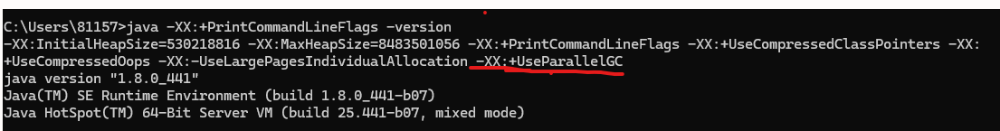


>Java的gc回收器主要有哪些？（曾经7种，现在6种）

回收器配对关系如下：红色的对应关系为当前适用的，蓝色的以前适用的

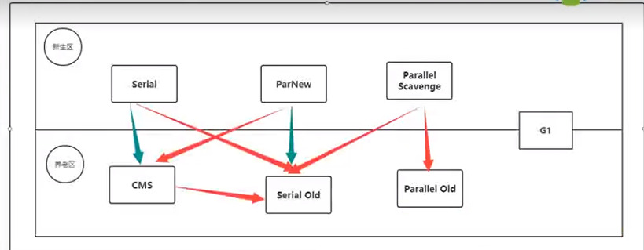

DefNew :默认的新一代

Tenured:label:老年代【Serial Old】

ParNew:large_blue_circle:并行新一代 【并行ParNew】

PSYoungGen: 并行清除年轻代 【Parallel Scavenge】

ParOldGen: 并行老年区

**JDK8使用的垃圾回收器：**

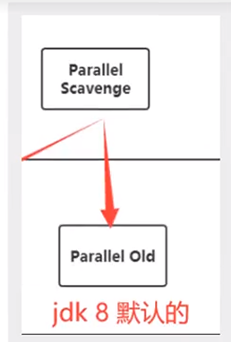


>Server /Client 模式

默认现在都是Server模式；Client几乎不会使用；

32位的windows操作系统，默认都是Client的JVM模式；

64位的操作系统默认都是Server 模式

>使用标准，如何选择合适的垃圾回收器？

1、单核，单机程序，内存小

`-XX:UseSerialGC`

2、多核，大的吞吐量，后台计算！

`-XX:UseParallelGC`

3、多核，不需要有时间停顿，快速响应！

`-XX:UseParNewGC`


# 谈谈G1垃圾回收器

>以前的垃圾回收器的特点

1、年轻代和老年代是各自独立的内存区域

2、年轻代使用Eden+s0+s1复制算法

3、老年代必须扫描整个老年代的区域；

4、垃圾回收器原则：尽可能少而快的执行GC为设计原则！


>G1垃圾回收器

G1(Garbage-First)收集器，面向服务器端应用的收集器！

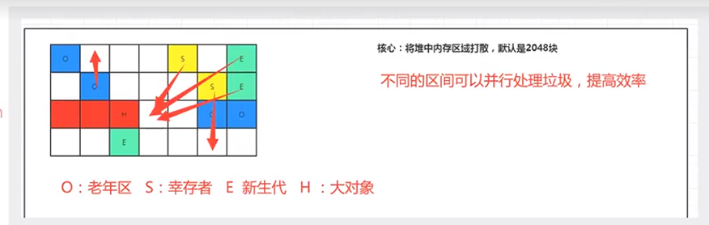

>如何使用

`-XX:+useG1GC`

>G1优点

1、没有内存碎片

2、可以精准空垃圾回收时间！

`-XX:MaxGCPauseMillins=100`最大的GC停顿时间单位：毫秒，JVM尽可能保证停顿小于这个时间！

# JVM结尾：强引用 软引用 弱引用 虚引用

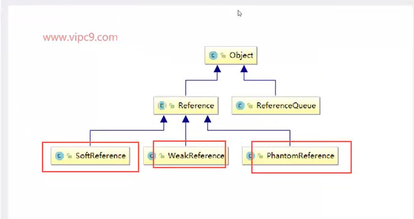


>强引用：通过new的方式就是强引用

强引用就是会导致内存泄漏的原因之一：

因为假如OOM报错或者其他异常，强引用都不会自动被回收掉！

>软引用（常用）

相当于强引用弱化了一些，如果系统内存充足GC也不会回收，只有内存不够才会回收！

>弱引用

不论内存是否充足，只要GC都会回收！

>虚引用

主要作用：跟踪对象的垃圾回收状态！相当于没有引用（少用）

>软引用和弱引用的使用场景？

假设现在有一个应用，需要读取大量本地图片；

1、如果每次读取图片都要从硬盘读取影响性能；

2、一次加载到内存中，可能造成内存溢出；

思路：

1. 内存不足够不清理
2. 内存不足够，清理加载到内存的数据
3. 使用hashMap保存图片路径和内容

```
HashMap<String, WeakReference<Pic>> stringWeakReferenceHashMap = new HashMap<>();
```

1. 当需要加载图片时，先检查这个缓存映射：
   - 如果存在对应的`SoftReference`并且`get()`方法返回的`Bitmap`不为`null`，则直接使用这个内存中的对象。**（缓存命中，性能最佳）**
   - 如果不存在或者`get()`返回`null`（表示Bitmap已被垃圾回收），则再从硬盘读取，并重新创建`SoftReference`放入缓存。**（缓存未命中，需要IO操作）**

