# JVM前言

>聊聊常见面试题

1、请你谈谈你对jvm的理解？Java虚拟机有什么更新？

2、什么时OOM，请你说说OOM产生的原因？如何分析？

3、JVM的常见调优参数有哪些？

4、内存快照抓取，如何分析,命令是什么？

5、堆里分区：eden、survial(from、to)、老年区

6、GC垃圾收集算法有哪几个？谈谈利弊？

>BAT难度的面试题

1、JVM垃圾回收的时候如何确定垃圾，GCRoot?

2、-X、-XX参数你用过哪些？

3、常见的项目发布后配置过JVM调优参数吗？

4、引用、强引用、弱引用、虚引用？

5、GC垃圾回收器和GC回收算法关系？分别有哪些？

6、谈谈默认的垃圾回收器？

7、垃圾回收器的特点？

8、OOM你看过几种？

# JVM类加载器ClassLoader

>类的加载、连接和初始化将car.class转为car Class

加载：查询.class文件并加载类的二进制数据

连接：

- 验证：保证被记载的类的正确性；
- 准备：给类的静态变量分配空间，赋值默认初始值；
- 解析：把类中的符号引用转换为直接引用；

初始化：给类的静态变量赋值正确的值；

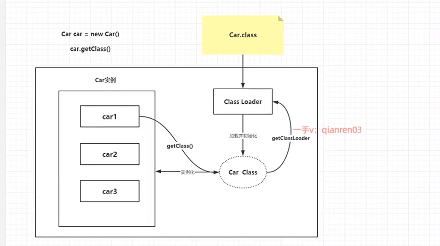

>类加载器分类

1、java虚拟机自带的加载器

- bootStrap 根加载器（加载系统的包，jdk核心库中的rt.jar）
- Ext              扩展类加载器（加载一些扩展jar包的类）
- Sys/App     系统/应用加载器 （我们编写的类）

2、用户自己定义的加载器

- ClassLaoder只需要继承这个抽象类即可，自定义自己的类加载器

双亲委派机制：可以保护java核心类不会被自定义的类替换

# 类的加载

new对象->判断是否加载完成->没有加载就先加载（加载了直接初始化使用）；

类加载：1、类加载器（Bootstrap/Ext/App/Custom）根据类的全限定名从磁盘读取class文件的二进制字节流；
      2、将字节流转为方法区的运行时数据结构（存储类的元信息，类名、父类、接口、字段、方法等）；
	  3、在堆空间里创建一个代表这个类的Class对象（后续反射就是操作这个对象）
	  4验证-准备（给方法区中静态变量分配内存且初始化0值）-解析-初始化（静态变量赋默认值）-使用（堆中创建实列对象分配内存，将引用变量放在栈中设置对象头（Object Header）-执行初始化方法<init>()）
	  
总结 ：Class 对象 vs 实例对象：
Class 对象是「类的镜像」（1 个类只有 1 个），代表 “类本身”；
实例对象是「类的产物」（可创建无数个），代表 “具体的业务对象”；
所有实例对象的类型指针都指向同一个 Class 对象。
总结 ：Class 对象 vs 方法区元信息：
方法区存「原始、底层的类元数据」（JVM 用），是数据源；
Class 对象存「指向方法区的引用」（Java 代码用），是访问入口；
Java 反射的本质，是通过 Class 对象操作方法区的类元数据。

```text
// user 在栈里，new User() 在堆里
User user = new User();
```

字段随对象一起在堆里。只有方法里的局部变量才在栈里。

```
/**
 * JVM参数有： -XX:+TraceClassLoading //1、用于追踪类的加载信息行打印 2、 分析项目为啥启动慢，可以快速定位自己类有没有被加载
 */
public class Main {

    public static void main(String[] args) throws InterruptedException {
        System.out.println(MyChild.str);
        //结果
        //MyParent static
        //MyChild static
        //hello MyChild
    }
}
class MyParent{
    static {
        System.out.println("MyParent static");
    }
    public static String str = "hello MyParent";
}

class MyChild extends MyParent{
    static {
        System.out.println("MyChild static");
    }
    public static String str = "hello MyChild";
}

```

# final加载分析

```
public class Main {

    public static void main(String[] args) throws InterruptedException {
        System.out.println(MyParent.str);
        /**
         *fianl常量编译阶段  常量池
         * 这个代码将常量放到了Main的常量池中，之后访问的str与MyParent.str都无关了
         * 所以返回结果虽然是hello MyParent ，但是不会触发System.out.println("MyParent static");
         */
    }
}
class MyParent{
    static {
        System.out.println("MyParent static");
    }
    public static final String str = "hello MyParent";
}
```

```
public class Main {

    public static void main(String[] args) throws InterruptedException {
        System.out.println(MyParent.str);
        /**
         *当一个常量并非在编译时就可以确定的，那么这个常量就不会保存在方法调用类的静态常量池中。
         * 程序运行期间的时候会主动使用常用的类
         */
    }
}
class MyParent{
    static {
        System.out.println("MyParent static");
    }
    public static final  String str = UUID.randomUUID().toString();
}
```

**编译优化过程：**
在编译阶段，`MyParent.str`  会被直接替换为字面量  `"hello MyParent"`。生成的 `Main.class` 字节码中**不会出现对 `MyParent` 类的符号引用**。

# Native方法

Native：只要带了这个关键字就说明java作用范围达不到，只能调用底层C语言的库！

```
public class Main {

    public static void main(String[] args) throws InterruptedException, AWTException {
        Robot robot = new Robot();
        robot.mouseMove(100,100);//控制鼠标位置
    }
}
```

# 程序计数器

线程私有，每个线程都由一个程序计数器；

程序计数器占有一个十分小的内存空间作用为：控制字节码执行位置

分支、循环、跳转、异常处理都需要依赖程序计数器来完成！

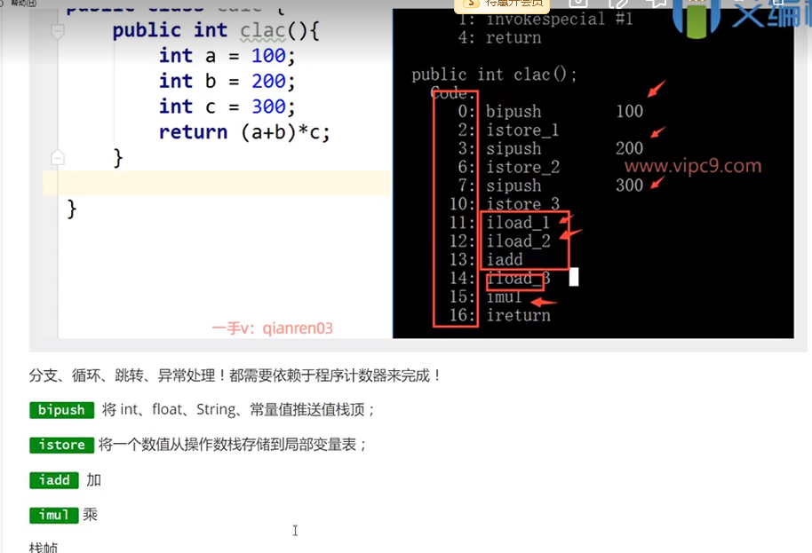

# 方法区的今生前世

Method Area方法区是Java虚拟机规范中定义的运行时数据区域一直和堆一样可以线程共享！

jdk1.7之前

永久代：用于存储一些虚拟机加载类的信息、常量、字符串、静态变量、符号引用、方法代码等。。。这些东西都放在永久代中；

但是永久代空间有限，满了后会报错`outOfMemery:java PermGen`

jdk1.8之后

将永久代改名为元空间 ，原来的东西放在堆中或者元空间Metaspace空间；

元空间就是方法区在hotspot jvm的实现；

元空间和永久代都是jvm规范中方法区的实现。

区别：元空间不在虚拟机内存，而是本地内存！

`-XX:MetaspaceSize10m`

如果元空间满了报错：`outOfMemery: Metaspace`

# 栈Stack

>栈和队列

程序=数据结构+算法

栈和队列都是基本的数据结构

栈的优势：存取速度比堆快！仅次于寄存器，栈的数据不可以共享

栈里面一定不存在垃圾回收问题，只要线程结束该栈就回收

>栈的原理

java栈的组成元素--栈帧

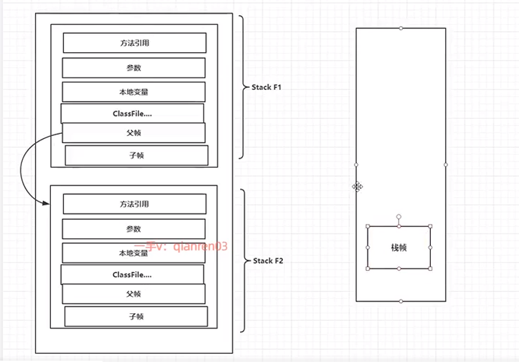

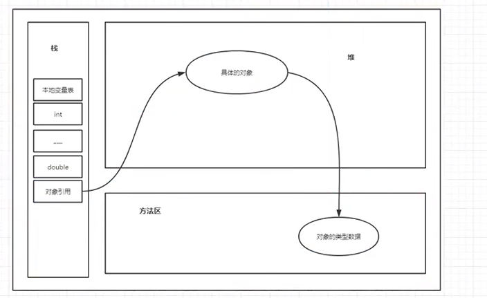

谈谈你认识几种JVM？

- SUN公司 Hotspot
- BEA公司 JRockit
- IBM公司 J9VM

# 堆（heap）

**java7之前：**

Heap堆：一个jvm实例中只存在一个堆，堆的内存大小时可以调节的。

可以存的内容：类、方法、常量、保留了类型引用的真实信息；

**分为三个部分**

- 新生区：Young   (Eden-s0-s1)

- 养老区：Old Tenure

- 永久区：Perm

  堆内存在逻辑上分为三个部分：新生、养老、永久（JDK1.8以后叫元空间）

  物理上只有新生区和养老区i，元空间在本地内存中！不在jvm中！

**垃圾回收主要是在新生区和养老区，又分为 普通GC和FULL GC，如果堆满了，就会报错OOM**

>新生区

新生区就是一个类诞生、成长、消亡的地方！、

*新生区细分*：Eden、s0/s1  ,所有的类都在Eden被new出来的，慢慢的当Eden满了，程序还需要创建对象时程序就会触发轻量级的GC，清理完一次垃圾之后，会将活着的对象放入幸存区。99%信息都在Eden区。

Sun Hotspot虚拟机中内存管理采用分代管理机制，即不同的区域采用不同的算法！

>养老区

超过15次对象还没被清理则将送到养老区;运行几个月后养老区如果也满了就触发重FULL GC ;

> 永久区

放一些jdk自带的Class、interface的元数据；

几乎不会被垃圾回收的;

`OutofMemoryError:PermGen` 在项目启动的时候永久代不够用？可能是加载了太多第三方包！

JDK1.6之前：有永久代、常量池在方法区；

JDK1.7：有永久代，但是开始尝试去掉永久代，常量池在堆中；

JDK1.8之后：永久代被取代为元空间**常量池还是在堆里中**；

闲聊：方法区和堆一样，是共享的区域，是JVM规范中的一个逻辑的部分，但是记住它的别名`非堆`

元空间：它是本地内存！

口诀：关于垃圾回收：分代收集算法 即不同的区域采用不同的算法

Young: GC频繁区域

Old:GC次数较少

Perm:不会产生GC

**特点：**

普通GC:只针对新生代 [GC]

全局GC:主要是针对老年代，偶尔伴随新生代 [FULL GC]

# 堆内存调优（初识）

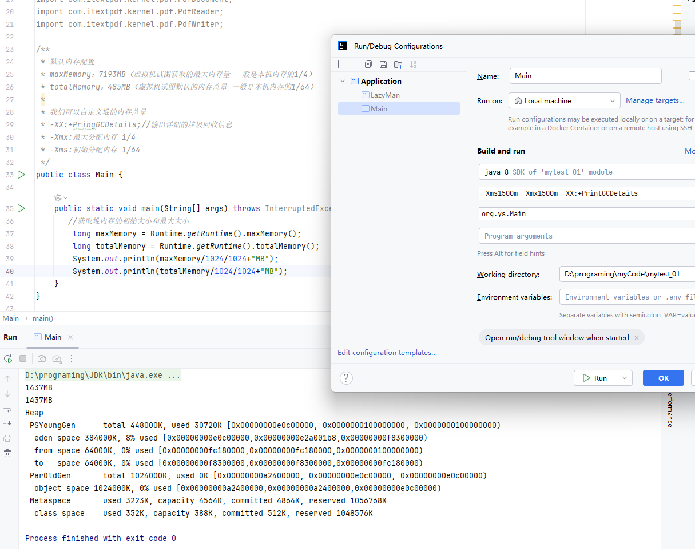

```
具体操作步骤
1、保留现场，首先线上提前加上-XX:-HeapDumpOnoutOfMemoryError 保证oom时可以生成dump文件 
2、先用jstat 判断gc频率回收效果（看full gc效果好不好，如果变化不大就怀疑内存泄露，如果变化很大就可以怀疑堆内存真不够），使用jstack和jmap看线程死锁死循环这种情况
3、再使用jprofilter 或者MAT分析和定位大对象 、GCROOT,常见问题一般是流没有关闭，threadlocal没有remove等，还有大对象内存中存储太多
```

# Dump内存快照及JProfiler

请你说说工作中怎么排查OOM

1、运行前操作

2、监控！

在Java程序运行的时候，想要测试运行的情况！

使用一些工具来查看；

1. Jconsole
2. idea debug
3. IDEA(JProfiler插件)

>JProfile插件

一款性能瓶颈分析插件

```
/**
 * 默认内存配置
 -Xmx1m -Xms1m -XX:+HeapDumpOnOutOfMemoryError
 */
public class Main {
    byte[] bytes = new byte[1024 * 1024 * 100];
    private ArrayList<Main> list = new ArrayList<>();
   public void test() throws InterruptedException {
       Main main = new Main();
       list.add(main);
   }
    public static void main(String[] args) throws InterruptedException, AWTException {
        Main main = new Main();
        main.test();
    }
}

```

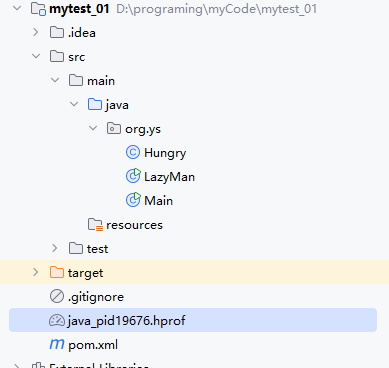


# GC四大算法

**1、JVM垃圾回收的时候如何确定垃圾，GCRoot?**

什么是垃圾:简单来说就是不再被引用的对象！

>引用计数法（了解即可）

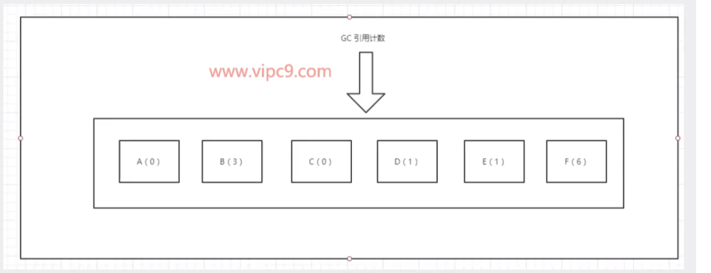

特点：每个对象都有一个引用计数器，每引用一次计数器+1，为0则直接垃圾回收

缺点：

- 计数器维护麻烦
- 循环引用无法处理！

JVM一般不采用这种方式！

>可达性算法，GC Root(普遍使用)

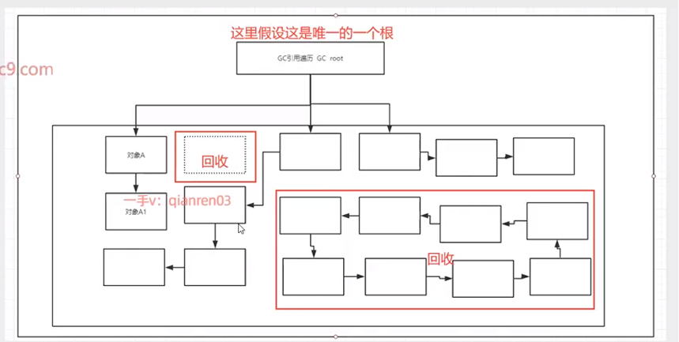

一切都是从GC Root这个对象开始遍历的，只有和GC Root这个对象关联就不是垃圾！

**什么是GC Root？**   栈、静态、常量、本地方法 = 四大 GC Roots

- 虚拟机栈中引用的对象！
- 类中静态属性引用的对象
- 方法区的常量
- 本地方法栈Native引用的对象


>复制算法

年轻代中就是使用复制算法！因为年轻代对象存活率低，适合全部复制过去，而不是检索某一部分对象复制过去！

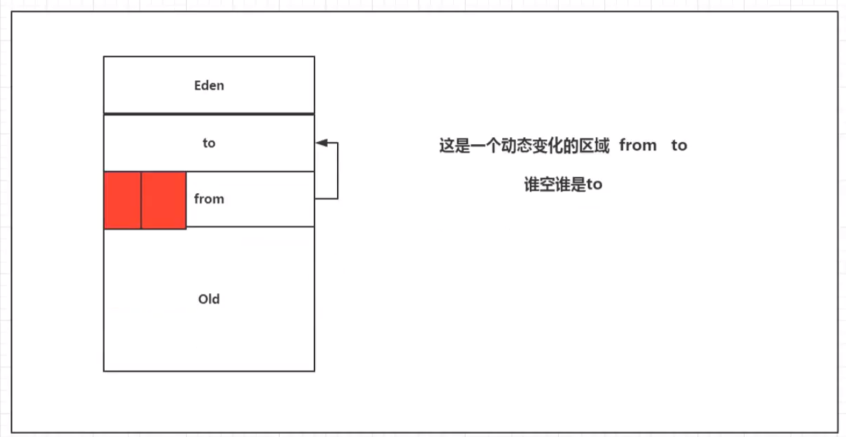

1、一般普通GC之后，差不多Eden几乎都是空的！

2、每次存活的对象都会被From区和Eden区等复制到to区，from和to会发生一次交换；说白了，谁空谁就是to，每当幸存一次就会导致这个对象年龄加一；如果这年龄大于15则会进入老年代

优点：没有标记和清除的过程，效率高！没有内存碎片！

缺点：需要浪费双倍的空间！

>标记清除算法

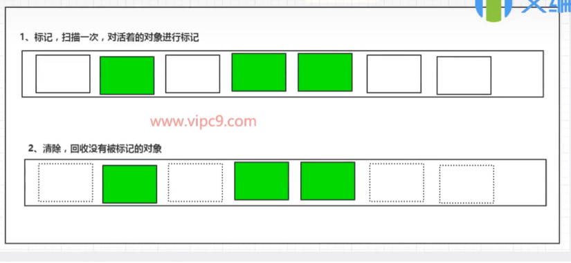

优点：不需要额外的空间

缺点: 两次扫描，内存活得对象耗时则比较多，会产生内存碎片，只能适合存活率高低的区域；

>标记压缩算法

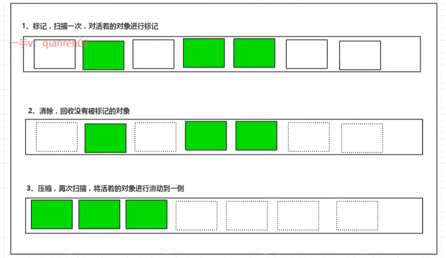

减少了上面标记清除的缺点，没有内存碎片但是再次加了一次扫描导致耗时更加严重！

那我们什么时候考虑使用标记压缩算法呢？

在我们这个要是有算法的空间种中，假设空间很少，不经常使用GC,那么可以考虑这个算法！

>**小总结**

内存效率：复制算法>标记清除>标记压缩算法

内存整齐度：复制算法=标记压缩>标记清除

内存利用率：标记压缩算法=标记清除>复制算法

**从效率上说，复制算法最好，空间但是浪费的比较多！为了兼顾所有指标，标记压缩算法会平滑一些，只是效率上不太行！**


**难道没有一种最优的算大吗？思考一下：**

没有！分代收集算法：不同的区域使用不同的算法！没有最好的只有最合适的！


**年轻代：**

相对于老年区，对象存活率低！

Eden区对象存活率极低！统计99%对象基本第一次使用后都会失效！推荐使用复制算法


**老年代：**

区域比较大，对象存活率较高！

推荐使用：标记清除/压缩！

# -XX、-XX参数你用过哪些？JVM有哪些参数可以来调优？

jvm只有三种参数类型：标配参数、X参数，XX参数；

>标配参数：在各个版本之间都很稳定，很少变化

```
java -version
java -help
....
```


>-X参数（了解即可）

```
-Xint   #解释执行
-Xcomp  #第一次使用就编译成本地的代码
-Xmixed #混合执行，一边编译一边解释
```

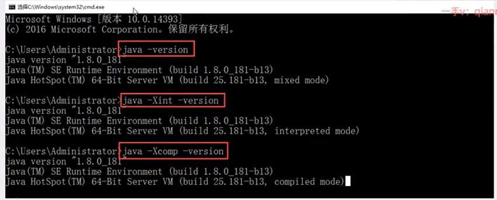


>重点(-XX参数)

-XX:+或者-某一个属性值，+代表开启某一个功能，-表示关闭某一个功能！

```
public class Main {
    public static void main(String[] args) throws InterruptedException, AWTException {
        System.out.println("hello word!");
        Thread.sleep(MAX_VALUE);
    }
}
```

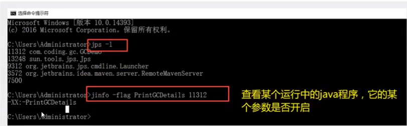


>-XX参数 之key-value型;

元空间大小：`-XX:MetaspaceSize=128M`

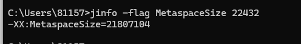

控制进入老年区存活年限（默认15次）

用法：`-XX:MaxTenuringThreshold=15`

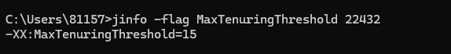

>查看所有默认值

`jps -l`

`jinfo -flags 22432`

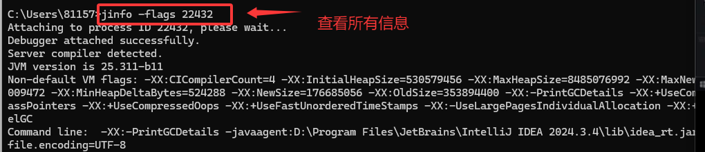


>经典面试题：-Xmx,-Xms,怎么解释？

1. `Xmx` 最大堆的大小，等价于`-XX:InitialHeapSize`
2. `Xms` 初始堆的大小，等价于`-XX:MaxHeapSize`

最常用的东西都有语法糖吗，方便使用记忆！


>初始的默认值是多少？

`java -XX:+PrintFlagsInitial`

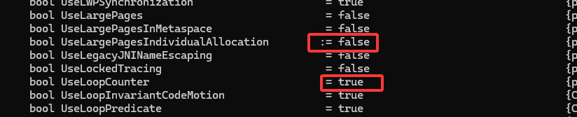

`:=`表示被修改了；

`java -XX:+PrintCommandLineFlags -version`  打印用户手动设置的-XX参数

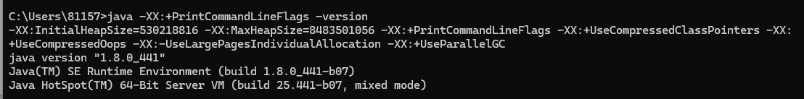

>-Xss: 线程栈大小 一般512k-1024k
>
>-XX: SurvivorRatio 设置新生代中s0/s1空间比例    `unit  -XX: SurvivorRatio =4 `
>
>表示Eden:s0:s1= 4：1：1

# 请你谈谈你对OOM的认识？

>堆溢出（常见）

>栈溢出（常见）

>`java.lang.OutOfMemoryError:  GC overhead limit exceeded`  GC回收时间过长也会导致OOM！

代码逻辑出错，CPU占有率100%，GC一直没有好的效果！导致报错！

```
/**
 * 默认内存配置
 -Xmx1m -Xms1m -XX:+PrintGCDetails -XX:+MaxDirectMemorySize=5m
 */
public class Main {
    public static void main(String[] args) throws InterruptedException, AWTException {
       int i =0;
        ArrayList<String> list = new ArrayList<>();
        try {
            while (true) {
                list.add(String.valueOf(i++).intern());
            }
        } catch (OutOfMemoryError e) {
            System.out.println(i);
            e.printStackTrace();
        }

    }
}
```

>`java.lang.OutOfMemoryError: Direct buffer memory ` 基础缓冲区的错误导致OOM！(少见)
>
>超过 MaxDirectMemorySize 限制;Netty 等 NIO 框架使用不当;未正确释放 Direct Buffer；
>
>频繁创建大量 Direct Buffer：

>`java.lang.OutOfMemoryError: unable to create native Thread`  服务器线程不够导致OOM！

高并发，unable to create native Thread这个错误更多时候是和平台有关系！

1. 应用创建的线程过多！
2. 服务器不允许你创建这么多线程！ 

>`java.lang.OutOfMemoryError: 元空间报错！

元空间里内容：

- 虚拟机的类信息、方法和字段的描述信息
- 常量池
- 静态变量
- JIT 编译器编译后的方法代码（部分）
- 。。。

# 三大 GC 组合完整场景落地手册

## 基础前置定义

1. 吞吐量：应用有效运行时长 /(应用运行时长 + 所有 GC 耗时)，越高批处理、计算效率越高；
2. 延迟：单次 GC STW 停顿时长，越小接口响应越稳，无超时；
3. 占比说明：吞吐量占比越高，GC 总耗时被压缩；延迟占比越高，单次停顿被压低。
4. 核心底层取舍：CPU 算力、内存、停顿三者做权衡。

表格

| 收集器组合 | 全称缩写                       | 堆管理模式      | 核心算法                                       |
| ---------- | ------------------------------ | --------------- | ---------------------------------------------- |
| 组合 A     | Parallel Scavenge+Parallel Old | 物理严格分代    | 新生代复制；老年代标记整理，全程并行 STW       |
| 组合 B     | ParNew+CMS                     | 物理严格分代    | 新生代复制；老年代标记清除，大量阶段并发       |
| 组合 C     | G1                             | Region 逻辑分代 | 分区复制整理，支持 Young GC/Mixed GC，可控停顿 |

# 一、Parallel Scavenge + Parallel Old（吞吐量优先收集器，JDK8 默认）

## 1. 吞吐量 & 延迟占比分配

- 吞吐量权重：**80%**
- 延迟权重：**20%** 设计思路：优先保证整体计算效率，愿意承受单次长时间 STW，换取 GC 整体总耗时最少。

### 底层为什么该权重有优势

1. 全部 GC 使用多线程并行，无并发线程竞争、无额外写屏障、无卡表复杂计算，CPU 全部用来回收垃圾，GC 总耗时最低；
2. 老年代使用标记整理，无内存碎片，不需要预留空闲内存应对碎片，内存利用率最高；
3. 没有并发标记的额外 CPU 开销，同等硬件下，业务能拿到更多 CPU 算力。

### 不可规避缺点

所有 GC 阶段**全量 STW**。老年代一旦触发回收，必须停下所有业务线程做标记 + 内存整理；堆越大，停顿越长。`MaxGCPauseMillis`只是软约束，存活对象多则一定会超时。

## 2. 精准使用场景 + 真实业务举例

适合：**离线业务、批处理、大数据计算、对响应无要求、能容忍几秒卡顿**

1. 数据 ETL、日志清洗、数仓同步服务：定时读取海量日志入库，跑任务几分钟甚至几小时，中途 GC 卡顿 1~2 秒完全不影响最终结果；
2. 后台定时报表、月度统计、订单对账任务：夜间低峰运行，不在乎停顿；
3. 大数据 Spark/Flink 本地任务、离线算法训练：追求跑完速度，不关心瞬时卡顿；
4. 内部管理后台：访问量极低，偶尔卡顿无感知。

### 绝对不适合

支付、网关、前端接口、MQ 消费等高并发在线服务，极易出现大量请求超时。

## 3. GC 行为特点

- Eden 满 → Young GC（多线程 STW，停顿短，日常常态）；
- 老年代空间不足、担保失败 → Full GC（全堆 STW 标记整理，重 GC，停顿几百 ms~ 数秒）；
- 几乎没有并发，所有 GC 工作集中一次性做完。

# 二、ParNew + CMS（低延迟折中收集器，早年互联网线上标配）

## 1. 吞吐量 & 延迟占比分配

- 吞吐量权重：**45%**
- 延迟权重：**55%** 为了压低 STW，主动牺牲近一半吞吐量，用额外 CPU 做并发计算，换取绝大多数时间业务不停顿。

### 底层优势逻辑

1. 新生代 ParNew 多线程并行回收，保证新生代停顿可控；
2. 老年代 6 阶段拆分，只有**初始标记、重新标记**两段短暂 STW，并发标记、并发清理和业务线程同时跑；
3. 把最耗时的堆扫描、垃圾清理移出停顿期，解决 Parallel 老年代长 STW 致命问题；
4. 依靠 Card Table 卡表做跨代引用，不用全堆扫描，缩短 STW 阶段工作量。

### 配套代价（吞吐量下降原因）

1. 并发阶段 GC 线程和业务线程争抢 CPU，CPU 开销上涨；
2. 卡表、写屏障带来额外指令消耗，应用正常运行略微变慢；
3. 标记清除产生内存碎片，需要预留更多老年代空闲内存，内存利用率下降；
4. 存在浮动垃圾，部分垃圾本轮无法回收，GC 频率变高。

## 2. 精准使用场景 + 真实业务举例

适合：**JDK8 存量在线业务、高并发 C 端服务、延迟敏感、无法升级 JDK**

1. 电商订单、商品详情、用户中心、小程序后端：接口超时阈值普遍 100/200ms，不能出现秒级停顿；
2. 网关服务、鉴权服务、支付回调：链路长，轻微卡顿就会链路雪崩；
3. 老旧 JDK8 微服务集群，无法升级 JDK17/21，又嫌弃 Parallel 的 Full GC 卡顿；

### 不适合场景

1. 超大堆（32G 以上）：碎片概率暴涨，容易并发模式失败退化成 Serial Old，长 STW；
2. CPU 资源紧张的低配机器：并发 GC 抢 CPU，业务整体变慢；
3. 新系统新项目：CMS JDK14 已被移除，长期维护风险高。

## 3. GC 行为特点

1. Eden 占满：ParNew 执行 Young 轻 GC，高频正常；
2. 老年代到达阈值：CMS 并发回收，不属于 Full GC，停顿可控；
3. 碎片过多、晋升暴增：并发模式失败，退化 Serial Old 串行 Full GC（重 GC 灾难）。

# 三、G1（平衡型收集器，JDK9 + 默认，当下通用最优折中）

## 1. 吞吐量 & 延迟占比分配

- 吞吐量权重：**60%**
- 延迟权重：**40%** 兼顾两头：延迟远好于 Parallel，吞吐量高于 CMS，综合平衡，无明显短板。可人工通过`MaxGCPauseMillis`灵活调整权重：
- 调小停顿时间 → 延迟权重升高、吞吐量下降；
- 放宽停顿限制 → 吞吐量权重升高、延迟略微变差。

### 底层双向优势拆解

#### 对延迟友好的设计

1. 堆拆分为大量 Region，不再全堆回收；分为 Young GC（只回收新生代分区）、Mixed GC（只回收垃圾最多的老年代分区）；
2. 老年代分片局部回收 + 复制整理，不会出现 CMS 全局碎片；
3. 可指定目标停顿时间，GC 会主动选择回收范围适配时长；
4. 仅初始标记、重新标记、复制清理短暂 STW，其余并发执行。

#### 对吞吐量友好的设计

1. RSet 替代全局卡表，只扫描目标分区的外部引用，减少无效扫描；
2. 不用为碎片预留大量冗余内存，内存利用率高于 CMS；
3. 无 CMS 并发模式失败这类突发性长停顿，GC 波动更小；
4. JDK8~JDK21 全版本支持，硬件适配范围广。

### 固定短板

相比 ZGC 延迟更高；相比 Parallel，多了并发开销，极致吞吐量略差。

## 2. 精准使用场景 + 真实业务举例

通用万金油，绝大多数新项目、存量改造首选。

### 场景 1：主流微服务（堆 4G~16G，JDK8/11/17）

外卖、短视频后端、会员服务、营销活动、第三方接口服务；既不能频繁超时，也不能无限制消耗 CPU。既怕 Parallel 的长 Full GC，又怕 CMS 碎片故障，G1 最稳妥。

### 场景 2：内存波动较大的业务

大缓存、列表查询频繁、有中等大小对象，容易产生碎片，CMS 极易踩坑，G1 分区天然防碎片。

### 场景 3：容器化 K8s 业务

容器 CPU、内存配额有限，不能像 CMS 一样消耗大量 CPU，也不能像 Parallel 随时长停顿，G1 平衡资源。

### 不适合场景

1. 堆 32G 以上超大堆极致低延迟：优先选 ZGC，G1 大堆停顿波动变大；
2. 纯离线跑批：直接用 Parallel，G1 额外开销没必要。

## 3. GC 行为特点

1. Young GC：轻 GC，只回收新生代分区，日常最频繁；
2. Mixed GC：新生代 + 部分高垃圾老年代分区，可控 STW，属于常规回收，不是重 GC；
3. 只有内存完全耗尽、巨型对象分配失败，才触发退化 Full GC（Serial Old 串行，线上需要极力避免）。

# 四、三者横向对比总表

表格

| 维度            | Parallel 组合                        | ParNew+CMS                         | G1                                        |
| --------------- | ------------------------------------ | ---------------------------------- | ----------------------------------------- |
| 吞吐 / 延迟配比 | 8:2                                  | 4.5:5.5                            | 6:4（可调）                               |
| 核心优势        | CPU 利用率最高、无碎片、内存利用率高 | 常规老年代 GC 停顿极短             | 灵活可调、无全局碎片、适配绝大多数场景    |
| 致命硬伤        | 老年代 Full GC 停顿不可控            | 内存碎片、并发失败、JDK 高版本废弃 | 超大堆延迟不如 ZGC，极致吞吐不如 Parallel |
| 最优硬件        | CPU 核心少、内存适中、机器空闲度高   | CPU 充足、堆≤16G、锁定 JDK8        | 常规 8 核 16G~16 核 32G 云服务器          |
| 标杆业务        | 离线 ETL、报表、大数据任务           | 老旧 JDK8 线上微服务               | 通用互联网所有在线服务、容器应用          |

# 五、极简选型落地口诀

1. 跑批、离线、不在乎卡顿 → Parallel，拉满吞吐量；
2. 老旧 JDK8 线上服务、改造成本高、追求低延迟 → CMS；
3. 绝大多数新业务、容器、JDK8~21、不想踩坑 → G1 万能平衡；
4. 若堆 > 16G 且追求极致低延迟，跳过三者直接选择 ZGC。

# 六、补充：权重动态调节方式

1. Parallel：只能偏向吞吐，几乎无法调高延迟权重；

2. CMS：配比固定，很难调整，硬件决定延迟上限；

3. G1：

   ```
   -XX:MaxGCPauseMillis
   ```

   是调节杠杆

   - 设置 100ms：延迟权重上涨，GC 回收范围变小，频次变多，吞吐量轻微下降；
   - 设置 300ms：放宽停顿，一次回收更多内存，GC 次数变少，吞吐量提升。

# JVM结尾：强引用 软引用 弱引用 虚引用

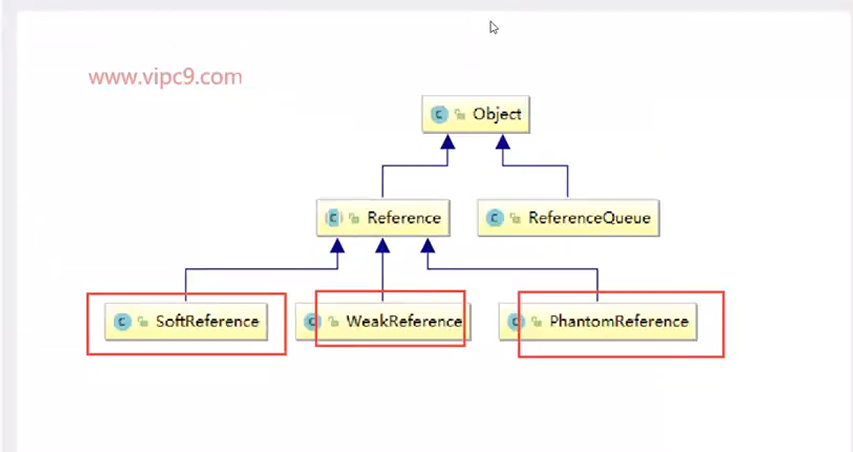


>强引用：通过new的方式就是强引用

强引用就是会导致内存泄漏的原因之一：

因为假如OOM报错或者其他异常，强引用都不会自动被回收掉！

>软引用（常用）

相当于强引用弱化了一些，如果系统内存充足GC也不会回收，只有内存不够才会回收！

>弱引用

不论内存是否充足，只要GC都会回收！

>虚引用

主要作用：跟踪对象的垃圾回收状态！相当于没有引用（少用）

>软引用和弱引用的使用场景？

假设现在有一个应用，需要读取大量本地图片；

1、如果每次读取图片都要从硬盘读取影响性能；

2、一次加载到内存中，可能造成内存溢出；

思路：

1. 内存不足够不清理
2. 内存不足够，清理加载到内存的数据
3. 使用hashMap保存图片路径和内容

```
HashMap<String, WeakReference<Pic>> stringWeakReferenceHashMap = new HashMap<>();
```

1. 当需要加载图片时，先检查这个缓存映射：
   - 如果存在对应的`SoftReference`并且`get()`方法返回的`Bitmap`不为`null`，则直接使用这个内存中的对象。**（缓存命中，性能最佳）**
   - 如果不存在或者`get()`返回`null`（表示Bitmap已被垃圾回收），则再从硬盘读取，并重新创建`SoftReference`放入缓存。**（缓存未命中，需要IO操作）**

