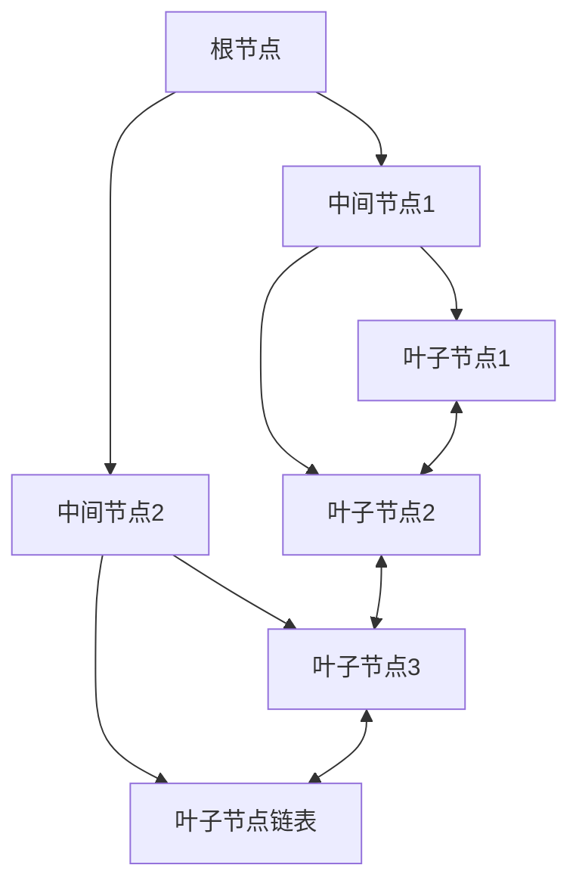
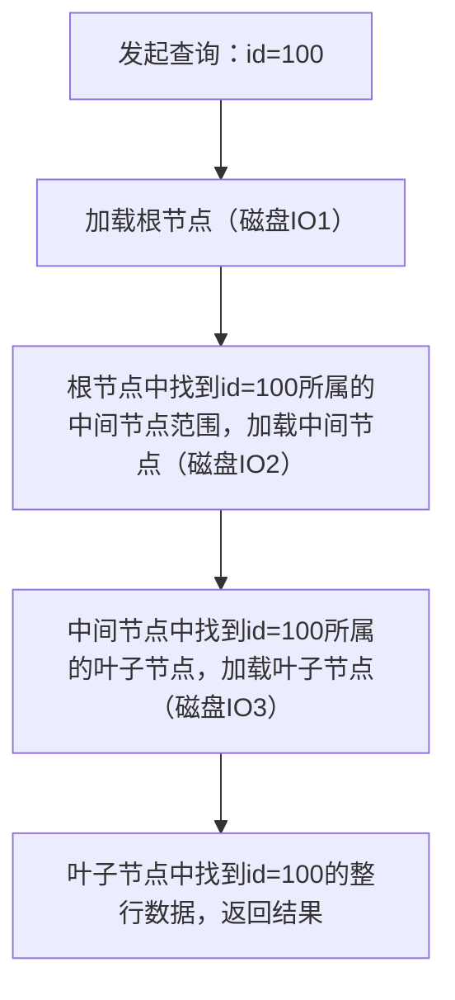
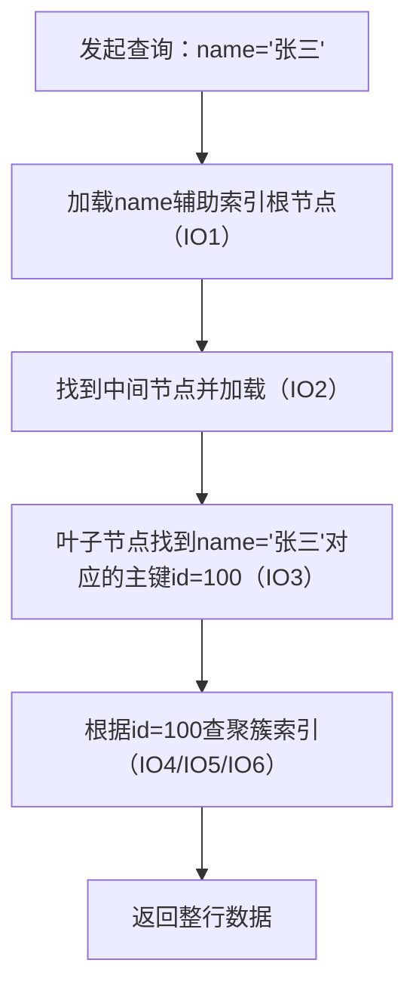
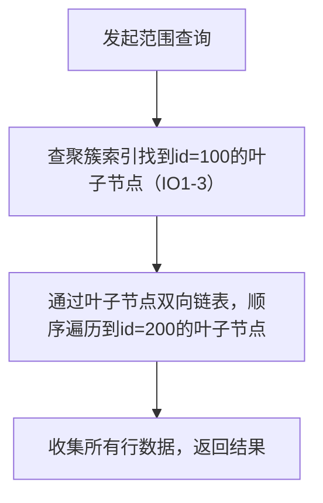
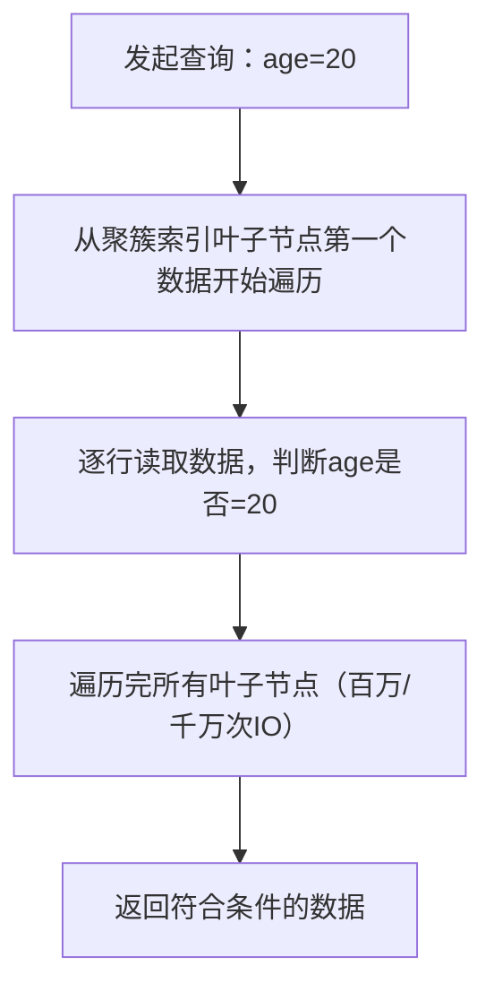

# MySQL 

MySQLInnoDB引擎的核心索引结构是**B+树**，这是面试高频考点，也是理解MySQL查询性能的关键。本文会从「B+树结构本质→InnoDB适配优化→查询流程（走/不走索引）→对比优势」层层拆解，既讲透底层原理，又结合实战场景，让你既能理解“为什么”，又能回答“怎么用”。

## 一、先搞懂：B+树的核心结构特点（从通用B+树到InnoDB定制版）

### 1. 通用B+树的结构特点（基础）

B+树是一种**多路平衡查找树**（区别于二叉查找树），核心设计围绕“磁盘IO优化”（数据库数据存储在磁盘，IO是性能瓶颈），结构特点如下：

#### 核心特点（通俗+专业）：

|特点|通俗解释|技术价值|
|---|---|---|
|1. 节点分层（根/中间/叶子）|类似图书目录：根节点是“大类”，中间节点是“小类”，叶子节点是“具体页码”|减少磁盘IO次数（一次IO加载一个节点）|
|2. 非叶子节点只存索引键，不存数据|目录页只写“章节名+下一级目录页码”，不写章节内容|单个节点能存更多索引键，树的高度更低（一般3-4层）|
|3. 叶子节点存全量数据（InnoDB）或数据指针（MyISAM）|只有“页码页”才写具体内容|所有查询最终落到叶子节点，保证查询效率稳定|
|4. 叶子节点双向链表连接|所有“页码页”按顺序串起来，能快速范围查找|支持`between...and`、`order by`等范围查询，无需全树遍历|
|5. 平衡树（所有叶子节点在同一层）|不管查哪个“页码”，翻目录的次数都一样|保证查询性能稳定（不会出现“极端深度”导致的慢查）|
### 2. InnoDB对B+树的定制优化（核心！面试必讲）

InnoDB的B+树不是通用版，而是针对数据库场景做了关键优化，这是理解MySQL索引的核心：

#### （1）聚簇索引（主键索引）的B+树：数据即索引

- **结构**：叶子节点直接存储整行数据（而非指针），非叶子节点存储主键值+子节点指针；

- **举例**：主键为`id`的`user`表，聚簇索引B+树的叶子节点就是`id=1`的整行数据（id/name/age/phone）；

- **核心价值**：查询主键时，找到叶子节点就拿到了全量数据，无需二次磁盘IO（MyISAM需要回表）。

#### （2）辅助索引（非主键索引）的B+树：叶子节点存主键值

- **结构**：叶子节点存储“索引键+主键值”，非叶子节点存储索引键+子节点指针；

- **举例**：`name`字段的辅助索引，叶子节点存储`name='张三' + id=1`；

- **核心价值**：辅助索引查询需“回表”（先查辅助索引拿到主键，再查聚簇索引拿数据），但主键索引是B+树，回表效率仍很高。

#### （3）树高控制（实战关键）

InnoDB默认页大小是16KB，一个B+树节点对应一个磁盘页：

- 非叶子节点：假设主键是bigint（8字节）+指针6字节=14字节/索引键，16KB节点可存≈16*1024/14≈1170个索引键；

- 3层B+树可存储数据量：1170（根）*1170（中间）*16KB（叶子）≈2200万行数据；

- 结论：**InnoDB的B+树高度一般是3层，查询任意数据最多3次磁盘IO**（这是MySQL查询快的核心原因）。

## 二、MySQL查询流程：走索引（B+树）vs 不走索引（全表扫描）

### 1. 走索引的查询流程（以聚簇索引/辅助索引为例）

#### （1）聚簇索引（主键查询）：`select * from user where id=100;`

- 核心：3次磁盘IO即可拿到数据，与数据量无关（哪怕表有1000万行，还是3次IO）。

#### （2）辅助索引（非主键查询）：`select * from user where name='张三';`

- 核心：辅助索引查询需“回表”，比主键查询多3次IO，但仍远快于全表扫描；

- 优化：覆盖索引（`select id,name from user where name='张三'`），只需查辅助索引（叶子节点已有id+name），无需回表，仅3次IO。

#### （3）范围查询（走索引）：`select * from user where id between 100 and 200;`

- 核心：只需定位范围起点，后续通过链表遍历，无需重复查上层节点，范围查询效率极高。

### 2. 不走索引的查询流程（全表扫描）：`select * from user where age=20;`

如果`age`字段未建索引，MySQL会执行全表扫描：

- 核心问题：

① 磁盘IO次数=叶子节点数量（表有1000万行，需1000万次IO）；

② 无法利用B+树的分层索引，性能呈线性下降（数据量越大，查询越慢）。

### 3. 为什么会“不走索引”？（面试高频）

除了“未建索引”，这些场景也会导致索引失效（不走B+树）：

|失效场景|例子|核心原因|
|---|---|---|
|1. 索引字段做函数运算|`select * from user where substring(name,1,1)='张'`|函数运算后的值不在B+树索引键中，无法匹配|
|2. 索引字段用模糊查询前缀%|`select * from user where name like '%三'`|B+树按索引键前缀排序，后缀模糊无法定位范围|
|3. 联合索引不满足最左匹配|联合索引`(name,age)`，查询`where age=20`|联合索引B+树按name排序，age无法单独索引|
|4. 索引字段类型不匹配|索引字段`phone`是varchar，查询`where phone=13800138000`|隐式类型转换导致索引失效|
|5. 查询结果占比过高（>30%）|`select * from user where age>18`（全表90%数据符合）|MySQL优化器认为全表扫描比走索引更高效|
## 三、B+树的对比优势（为什么MySQL选B+树而非其他结构）

### 1. 对比二叉查找树（BST）

|维度|B+树|二叉查找树|优势体现|
|---|---|---|---|
|树高|3-4层（固定）|极端情况退化为链表（N层）|B+树IO次数固定（3-4次），BST可能百万次IO|
|磁盘IO|一次IO加载一个节点（多索引键）|一次IO加载一个节点（仅1个索引键）|B+树IO效率提升千倍|
|范围查询|叶子节点链表快速遍历|需递归遍历整棵树|B+树范围查询效率提升百倍|
### 2. 对比B树（B-树）

B树（B-树）是B+树的前身，核心区别是“非叶子节点也存数据”：

|维度|B+树|B树|优势体现|
|---|---|---|---|
|节点存储量|非叶子节点只存索引键，单节点存更多键|非叶子节点存索引键+数据，单节点存键少|B+树树高更低（3层 vs B树5-6层），IO次数更少|
|查询效率|所有查询都到叶子节点，效率稳定|部分查询在非叶子节点返回，效率不稳定|B+树查询性能可预测（3次IO），适合数据库场景|
|范围查询|叶子节点链表遍历，无需回退|需反复遍历上层节点，效率低|B+树是唯一适合范围查询的树结构|
### 3. 对比哈希索引

MySQL也支持哈希索引（Memory引擎默认），但InnoDB优先用B+树：

|维度|B+树|哈希索引|优势体现|
|---|---|---|---|
|等值查询|3次IO|1次哈希计算|哈希略快，但差距小|
|范围查询|高效（链表遍历）|完全不支持（哈希值无序）|B+树是范围查询的唯一选择|
|排序|叶子节点有序，无需额外排序|哈希值无序，需全量排序|B+树天然支持`order by`|
|索引失效|有明确规则，可优化|几乎无法优化（只支持等值）|B+树适配更多业务场景|
### 4. 对比红黑树

红黑树是平衡二叉树，适合内存数据（如Java TreeMap），但不适合磁盘：

|维度|B+树|红黑树|优势体现|
|---|---|---|---|
|树高|3-4层|百万数据需20层|B+树IO次数（3次）远少于红黑树（20次）|
|磁盘IO适配|节点大小=磁盘页（16KB），一次IO加载一个节点|节点大小无适配，IO碎片化|B+树最大化利用磁盘IO特性|
## 四、面试核心话术（直接套用）

### 1. B+树结构特点（面试官追问时）

“InnoDB的B+树是多路平衡查找树，核心特点有3个：

1. 分层存储：非叶子节点只存索引键，叶子节点存全量数据（聚簇索引）或主键值（辅助索引），单节点存储更多索引键，树高控制在3层；

2. 平衡特性：所有叶子节点在同一层，保证查询性能稳定（最多3次磁盘IO）；

3. 叶子节点双向链表：支持高效范围查询，这是哈希索引、B树无法替代的。

另外，聚簇索引的设计让主键查询无需回表，进一步提升效率。”

### 2. 走索引vs不走索引的查询流程（面试官追问时）

“走主键索引查询时，MySQL会通过B+树的根节点→中间节点→叶子节点，3次IO拿到整行数据；走辅助索引需要先查辅助索引拿到主键，再回表查聚簇索引，共6次IO，但仍远快于全表扫描。

不走索引的全表扫描，需要遍历聚簇索引所有叶子节点，IO次数等于数据量，性能随数据量线性下降。

实际项目中，我会通过避免索引字段函数运算、满足联合索引最左匹配等方式，保证索引生效，比如将`substring(name,1,1)='张'`优化为`name like '张%'`，让查询走B+树索引，性能提升千倍。”

### 3. B+树的对比优势（面试官追问时）

“MySQL选择B+树而非B树/哈希/红黑树，核心是适配数据库的磁盘IO特性：

1. 对比B树：B+树非叶子节点只存索引键，树高更低，IO次数更少，且叶子节点链表支持范围查询；

2. 对比哈希索引：B+树支持范围查询和排序，适配90%以上的业务场景；

3. 对比红黑树：B+树树高仅3层，IO次数远少于红黑树的20层，更适合磁盘存储。

这也是InnoDB将B+树作为默认索引结构的核心原因。”

## 五、核心要点总结

1. **结构核心**：InnoDB B+树分聚簇/辅助索引，聚簇索引叶子节点存数据，树高3层，查询最多3次IO；

2. **查询核心**：走索引=B+树分层查找，不走索引=全表扫描，索引失效会导致查询性能断崖式下降；

3. **优势核心**：B+树适配磁盘IO（节点=磁盘页）、性能稳定（平衡树）、支持范围查询（链表），是数据库索引的最优选择。

这套内容覆盖了B+树的底层原理、实战场景和面试考点，既能讲清“是什么”，又能说明“为什么”，让面试官认可你对MySQL索引的深度理解。

### MyISAM 和 InnoDB 核心区别（极简版）

我用最核心的 5 个维度总结，兼顾新手易懂性和面试高频考点：

表格

|  核心特性   |          MyISAM          |                InnoDB                |
| :---------: | :----------------------: | :----------------------------------: |
|  事务支持   |  不支持（非事务型引擎）  |     支持 ACID 事务（事务型引擎）     |
|   锁粒度    | 表级锁（更新时锁整张表） |    行级锁（仅锁修改行，并发更好）    |
|  聚簇索引   | 无（所有索引都是非聚簇） | 有（主键是聚簇索引，叶子节点存数据） |
|  崩溃恢复   |    不支持（易丢数据）    | 支持（redo/undo 日志保证数据一致性） |
| 外键 / 约束 |          不支持          |                 支持                 |

### 补充高频场景

1. **MyISAM 适用**：读多写少（如博客、报表）、追求查询速度，无需事务 / 并发控制；
2. **InnoDB 适用**：读写频繁（如电商、金融）、需要事务 / 行锁 / 崩溃恢复，是 MySQL 默认引擎。

------

### 总结

1. 核心差异在**事务、锁粒度、索引结构**：InnoDB 主打事务和高并发，MyISAM 主打只读场景的性能；
2. 实际开发中**优先用 InnoDB**，MyISAM 仅用于极特殊的只读场景；
3. 行级锁让 InnoDB 并发更新更高效，而 MyISAM 表锁会导致写操作阻塞所有读。

索引失效核心场景:

 1、索引做函数 / 运算处理；

-- 索引：create index idx_age on user(age); SELECT * FROM user WHERE age + 1 = 30; 

-- 运算：失效 SELECT * FROM user WHERE DATE(create_time) = '2024-01-01'; 

-- 函数：失效 SELECT * FROM user WHERE phone = '13800138000' + 0; -- 类型转换：失效

2、模糊查询：% 放在开头

3、联合索引：不满足最左前缀原则

4、搜索字段类型不匹配(隐式类型转换)

5、or

6、使用 NOT IN / NOT EXISTS / <>（不等于）

-- 索引：create index idx_age on user(age); SELECT * FROM user WHERE age NOT IN (20,30); 

-- 失效 SELECT * FROM user WHERE age <> 25; -- 失效

## 核心示例：一条 SQL 的执行全过程

以 `SELECT name FROM user WHERE age=30;` 为例（InnoDB 引擎，user 表有 idx_age 索引）：

1. 客户端通过连接器建立连接，验证权限；
2. 跳过查询缓存（8.0+）；
3. 分析器识别出 “查 user 表的 name 字段，条件 age=30”，生成解析树；
4. 优化器判断 “走 idx_age 索引” 比全表扫描更优，生成执行计划；
5. 执行器检查权限后，调用 InnoDB 接口：“用 idx_age 找 age=30 的行，返回 name”；
6. InnoDB 先查 Buffer Pool，若有 age=30 的数据，直接返回 name；若无，从磁盘读取 idx_age 索引的 B+ 树，找到 age=30 对应的聚簇索引行，读取 name 并加载到 Buffer Pool，再返回；
7. 执行器整理结果，返回给客户端。

## 数据库知识点随笔

 1、什么是范式？1nf  2nf  3nf?

1NF:数据库表要求一个字段列只能存储一个值，比如一个name列不能存“张三28岁”；

2NF：数据库表要求在满足第一范式的情况下，非主键字段不能依赖部份主键信息，比如联合主键的情况，学生表中主键为（学生id和班级id），其他字段又有学生姓名和班级名称，这种情况学生姓名和班级名称都只是部分依赖主键id，会导致修改班级名称时，需要修改很多行的班级名称（数据冗余、修改麻烦）；

3NF:在满足第二范式的情况下，**非主键列之间不能有传递依赖**（即：非主键列只能直接依赖主键，不能通过其他非主键列间接依赖主键）。比如学生表中主键为学生id，非主键有学生姓名、班级id、班级姓名，前两个非主键字段都是依赖学生id的，但是班级姓名是依赖班级id的，那么学生id、班级id、班级姓名三个字段就出现依赖传递的情况，造成的危害（数据冗余、修改麻烦等）

