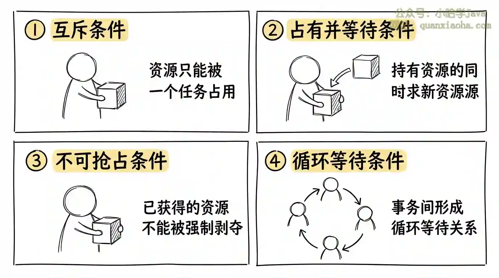
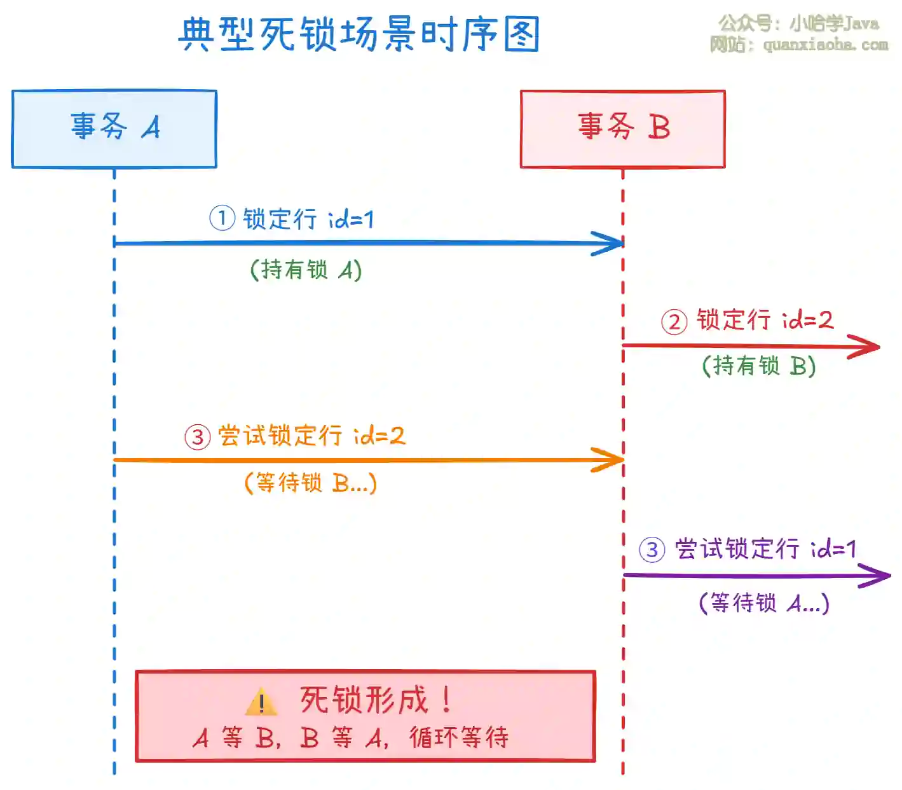

# 数据库事务核心知识点（面试全覆盖版）

## 一、事务的核心定义

事务（Transaction）是数据库执行操作的**最小逻辑工作单元**，它将一组SQL操作封装成一个整体，要么全部执行成功（提交），要么全部执行失败（回滚），核心解决「多操作一致性」问题。

**通俗举例**：银行转账（A扣钱+B加钱），要么都成功，要么都失败，绝不能出现A扣钱但B没加钱的情况。

## 二、事务的四大特性（ACID）

### 1. 原子性（Atomicity）

- **定义**：事务是不可分割的最小单位，事务内的所有操作「要么全成，要么全不成」。

- **实现原理**：

    - 数据库通过「undo日志」实现原子性：执行SQL时记录反向操作（如插入→删除、更新→还原原值），回滚时执行undo日志恢复数据。
    - undolog(存储修改操作前的数据)

- **考点**：
- 问：原子性和一致性的区别？
  
- 答：原子性保证「操作不拆分」，一致性保证「数据合法」，原子性是一致性的前提。

### 2. 一致性（Consistency）

- **定义**：事务执行前后，数据库从一个「合法状态」切换到另一个「合法状态」，所有业务规则（如约束、外键、总数不变）始终满足。

- **举例**：转账前后，A+B的总金额不变；库存扣减后，库存数≥0。

- **核心特点**：一致性是事务的「最终目标」，由原子性、隔离性、持久性共同保障。

### 3. 隔离性（Isolation）

- **定义**：多个并发事务之间相互隔离、互不干扰，每个事务感觉不到其他事务的存在。

- **核心问题**：并发事务可能引发的异常（面试必问）：

|    异常类型|    定义|
|---|---|
|    脏读（Dirty Read）|    事务A读取了事务B未提交的数据，B回滚后，A读到的是「脏数据」。|
|    不可重复读（Non-repeatable Read）|    事务A多次读取同一数据，期间事务B修改并提交了该数据，A前后读取结果不一致。|
|    幻读（Phantom Read）| 事务A按条件范围查询数据，期间事务B插入或者删除了符合条件的数据，A再次查询结果行数变化。 |
- **隔离级别（MySQL默认：可重复读）**：

|    隔离级别|    脏读|    不可重复读|    幻读|    性能|    实现原理|
|---|---|---|---|---|---|
|    读未提交（Read Uncommitted）|    ✅|    ✅|    ✅|    最高|    无锁，直接读未提交数据|
|    读已提交（Read Committed）|    ❌|    ✅|    ✅|    较高|    行锁+MVCC（每次查询生成新快照）|
|    可重复读（Repeatable Read）|    ❌|    ❌|    ❌|    中等|    行锁+MVCC（事务内共用快照）|
|    串行化（Serializable）|    ❌|    ❌|    ❌|    最低|    表级锁，事务串行执行|
- **面试考点**：

    - 问：MySQL的可重复读如何解决幻读？

    - 答：在 MySQL/InnoDB 里，“可重复读如何解决幻读”这个问题容易混淆，因为答案取决于你说的是哪一种读：
    
      **结论：普通快照读靠 MVCC；当前读靠 next-key lock，也就是临键锁。**
    
      ### 1. 普通 `SELECT`：靠 MVCC 避免“看到幻影”
    
      例如：
    
      ```
      START TRANSACTION;
      
      SELECT * FROM user WHERE age > 10;
      
      -- 另一个事务插入 age = 20 并提交
      
      SELECT * FROM user WHERE age > 10;
      ```
    
      在 InnoDB 的默认隔离级别 `REPEATABLE READ` 下，第一次普通 `SELECT` 会创建一个 Read View。后续普通 `SELECT` 继续基于这个一致性视图读取，所以即使别的事务插入了符合条件的新行并提交，当前事务也看不到。
    
      所以这种场景下，幻读是通过 **MVCC 快照读** 避免的。
    
      ### 2. `SELECT ... FOR UPDATE` / `UPDATE` / `DELETE`：靠临键锁避免插入
    
      例如：
    
      ```
      START TRANSACTION;
      
      SELECT * FROM user WHERE age > 10 FOR UPDATE;
      ```
    
      这是当前读，不是快照读。它读的是最新已提交数据，并且要加锁。
    
      为了防止其他事务在 `age > 10` 的范围里插入新记录，InnoDB 会使用：
    
      ```
      record lock + gap lock = next-key lock
      ```
    
      也就是临键锁。
    
      临键锁不仅锁住已有记录，还锁住记录之间的间隙。这样其他事务就不能往这个范围里插入新行，从而防止当前读场景下的幻读。
    
      ### 3. 所以两种说法都对，但适用场景不同
    
      | 场景                    | 如何防幻读                             |
      | ----------------------- | -------------------------------------- |
      | 普通 `SELECT` 快照读    | MVCC / Read View                       |
      | `SELECT ... FOR UPDATE` | 临键锁 / next-key lock                 |
      | `UPDATE` / `DELETE`     | 临键锁或相关范围锁                     |
      | 唯一索引等值命中单行    | 可能退化为 record lock，不一定用临键锁 |
    
      

### 4. 持久性（Durability）

- **定义**：事务提交后，修改永久生效，即使数据库崩溃、服务器宕机，数据也不会丢失。

- **实现原理**：

    - 数据库通过「redo日志」实现持久性：执行SQL时先写redo日志（落盘），再修改内存数据，提交时标记日志完成；崩溃恢复时，通过redo日志重放已提交的修改。

- **面试考点**：

    - 问：提交事务后马上断电，数据会丢吗？

    - 答：不会。因为redo日志先于数据落盘，恢复时会从redo日志还原已提交的修改。

## 三、事务的实现机制（深入层面，面试加分）

### 1. 日志机制（ Log）

|日志类型|作用|操作内容|
|---|---|---|
|Undo Log|回滚数据，保证原子性|执行SQL时实时记录|
|Redo Log|恢复数据，保证持久性|事务执行过程中**不断写入**，事务 **commit 时必须落盘**|
|BinLog|主从 + 恢复（二进制日志）|记录所有修改类的sql，适合实时同步数据|
### 3. MVCC（多版本并发控制）

- **定义**：为每行数据维护多个版本，事务读取「快照版本」而非最新版本，实现「读不加锁、写不阻塞读」。

- **核心字段（InnoDB）**：

    - `DB_TRX_ID`：修改数据的事务ID；

    - `DB_ROLL_PTR`：指向undo日志的指针（用于回滚/读取旧版本）；

- **作用**：在可重复读/读已提交级别下，兼顾隔离性和并发性能。

# 什么是数据库死锁，怎么解决？

## 核心答案

**数据库死锁**是指两个或多个事务在执行过程中，因争夺资源而造成的一种互相等待的现象。当死锁发生时，这些事务都无法继续执行，除非有外力介入打破这种循环等待。

**解决方案**可以从三个层面来处理：

| 层面             | 方法                       | 说明                                                         |
| ---------------- | -------------------------- | ------------------------------------------------------------ |
| **数据库层面**   | 超时机制、死锁检测         | `innodb_lock_wait_timeout` 设置等待超时；`innodb_deadlock_detect` 开启死锁检测（默认开启） |
| **SQL 编写层面** | 统一访问顺序、减小事务粒度 | 所有事务按相同顺序访问表和行；大事务拆分为小事务             |
| **业务设计层面** | 降低隔离级别、优化索引     | 使用 RC 隔离级别减少锁范围；建立合适索引避免全表扫描         |

**一句话总结**：死锁无法完全避免，但通过统一访问顺序、减小锁粒度、优化索引等手段可以大幅降低发生概率，同时配合数据库的死锁检测和超时机制来兜底。

## 深度解析

### 一、死锁产生的四个必要条件





上图展示了死锁产生的四个必要条件。只有当这四个条件**同时满足**时，死锁才会发生。因此，预防死锁的核心思路就是**破坏其中一个或多个条件**。

- **互斥条件**：资源在同一时间只能被一个事务占用。数据库锁天然满足这个条件，无法破坏。
- **占有并等待条件**：事务已经持有了某些资源，同时还在等待获取其他资源。可以通过"一次性申请所有资源"来破坏，但实现成本较高。
- **不可抢占条件**：事务已获得的资源不能被强制剥夺。数据库可以通过超时或死锁检测机制来"抢占"（回滚其中一个事务）。
- **循环等待条件**：事务之间形成循环等待关系。可以通过"统一访问顺序"来破坏，这是最实用的方法。

### 二、典型死锁场景演示





上图展示了最常见的死锁场景：**两个事务以不同顺序访问相同的资源**。

具体流程如下：

- **步骤 ①**：事务 A 首先锁定 `id=1` 的行，成功获得锁 A。
- **步骤 ②**：事务 B 同时锁定 `id=2` 的行，成功获得锁 B。
- **步骤 ③**：事务 A 尝试锁定 `id=2` 的行，但该行已被事务 B 锁定，因此进入等待状态。
- **步骤 ④**：事务 B 尝试锁定 `id=1` 的行，但该行已被事务 A 锁定，也进入等待状态。

此时形成了**循环等待**：A 等待 B 释放锁，B 等待 A 释放锁，谁都无法继续，死锁产生。


### 三、解决方案详解

#### 1. 统一访问顺序（破坏循环等待条件）


```sql
-- ❌ 错误示例：不同事务以不同顺序访问
-- 事务 A：先 1 后 2
UPDATE accounts SET balance = balance - 100 WHERE id = 1;
UPDATE accounts SET balance = balance + 100 WHERE id = 2;

-- 事务 B：先 2 后 1
UPDATE accounts SET balance = balance - 100 WHERE id = 2;
UPDATE accounts SET balance = balance + 100 WHERE id = 1;

-- ✅ 正确示例：统一按 id 升序访问
-- 事务 A 和 B 都按相同顺序
UPDATE accounts SET balance = balance - 100 WHERE id = 1;
UPDATE accounts SET balance = balance + 100 WHERE id = 2;
```

**核心原则**：所有涉及多表或多行操作的事务，都按照**相同的顺序**（如按主键升序）访问资源，这样就不会形成循环等待。

#### 2. 减小事务粒度（减少锁持有时间）


```sql
-- ❌ 错误示例：大事务，锁持有时间长
BEGIN;
-- 查询数据
SELECT * FROM orders WHERE user_id = 100;
-- 调用外部接口（耗时操作）
CALL external_service();
-- 更新数据
UPDATE orders SET status = 'PAID' WHERE user_id = 100;
COMMIT;

-- ✅ 正确示例：拆分事务，减少锁持有时间
-- 事务 1：只负责查询
SELECT * FROM orders WHERE user_id = 100;

-- 事务 2：只负责更新（锁持有时间短）
BEGIN;
UPDATE orders SET status = 'PAID' WHERE user_id = 100;
COMMIT;
```

**核心原则**：将大事务拆分为多个小事务，**只在必要时获取锁**，并尽快释放。避免在事务中执行耗时操作（如网络请求、复杂计算）。

#### 3. 优化索引（减少锁范围）


```sql
-- ❌ 错误示例：无索引导致全表扫描，锁定所有行
-- 假设 status 字段没有索引
UPDATE orders SET status = 'CANCELLED' WHERE status = 'PENDING';

-- ✅ 正确示例：建立索引，只锁定符合条件的行
CREATE INDEX idx_status ON orders(status);
UPDATE orders SET status = 'CANCELLED' WHERE status = 'PENDING';
```

**核心原则**：没有合适的索引时，数据库可能进行**全表扫描**并锁定所有扫描过的行（取决于隔离级别），极大增加死锁概率。建立合适的索引可以让数据库**只锁定目标行**。

#### 4. 数据库层面的配置


```sql
-- 查看当前死锁检测配置
SHOW VARIABLES LIKE 'innodb_deadlock_detect';

-- 查看锁等待超时时间（默认 50 秒）
SHOW VARIABLES LIKE 'innodb_lock_wait_timeout';

-- 调整超时时间（根据业务需求）
SET innodb_lock_wait_timeout = 30;
```

| 参数                       | 默认值 | 说明                                         |
| -------------------------- | ------ | -------------------------------------------- |
| `innodb_deadlock_detect`   | ON     | 开启死锁检测，发现死锁后自动回滚其中一个事务 |
| `innodb_lock_wait_timeout` | 50     | 锁等待超时时间（秒），超时后事务自动回滚     |

**核心原则**：生产环境建议**开启死锁检测**（默认开启），并设置合理的超时时间。死锁检测能主动发现并解决死锁，超时机制作为兜底。

### 四、死锁排查与监控


```sql
-- 查看最近的死锁信息
SHOW ENGINE INNODB STATUS;

-- 在输出中查找 "LATEST DETECTED DEADLOCK" 部分
-- 可以看到：
-- 1. 哪些事务参与了死锁
-- 2. 每个事务持有哪些锁
-- 3. 每个事务在等待哪些锁
-- 4. MySQL 选择回滚了哪个事务
```

**监控建议**：

- 定期检查 `SHOW ENGINE INNODB STATUS` 输出中的死锁信息
- 开启慢查询日志和错误日志，记录死锁发生的时间点
- 使用监控工具（如 Prometheus + Grafana）监控 `Innodb_deadlocks` 指标
- 建立死锁告警机制，及时发现异常

## 面试高频追问

1. **InnoDB 是如何检测死锁的？**

   InnoDB 使用**等待图**算法：为每个事务创建节点，如果事务 A 等待事务 B 的锁，就画一条 A → B 的边。定期检测图中是否存在环，存在环则说明有死锁。

2. **发生死锁后，MySQL 如何选择回滚哪个事务？**

   MySQL 会选择**回滚代价最小**的事务，通常是根据事务已经修改的行数、锁定的资源数量等因素来判断。

3. **RR 和 RC 隔离级别下，死锁有什么区别？**

   RR（可重复读）使用 **Gap Lock** 和 **Next-Key Lock**，锁定范围更大，死锁概率更高；RC（读已提交）只使用 **Record Lock**，锁定范围小，死锁概率相对较低。

## 常见面试变体

- "你项目中遇到过死锁吗？是怎么排查和解决的？"
- "如何设计系统来预防数据库死锁？"
- "MySQL InnoDB 的锁机制是什么？什么情况下会产生死锁？"
- "Gap Lock 是什么？它和死锁有什么关系？"

## 记忆口诀

**死锁四个条件**：互斥、占有等、不可抢、循环等（四个必须同时满足）

**解决方案**：统一顺序破循环，小事务减持有，加索引缩范围，开检测做兜底

**排查口诀**：SHOW ENGINE STATUS 看死锁，哪个事务哪把锁，等待图谱全明了

## 总结

数据库死锁是多事务并发时资源竞争导致的循环等待现象。核心解决方案是**统一访问顺序**（破坏循环等待）、**减小事务粒度**（减少锁持有时间）、**优化索引**（减少锁范围），同时配合数据库的**死锁检测和超时机制**兜底。生产环境中应建立死锁监控告警，及时发现并处理问题。